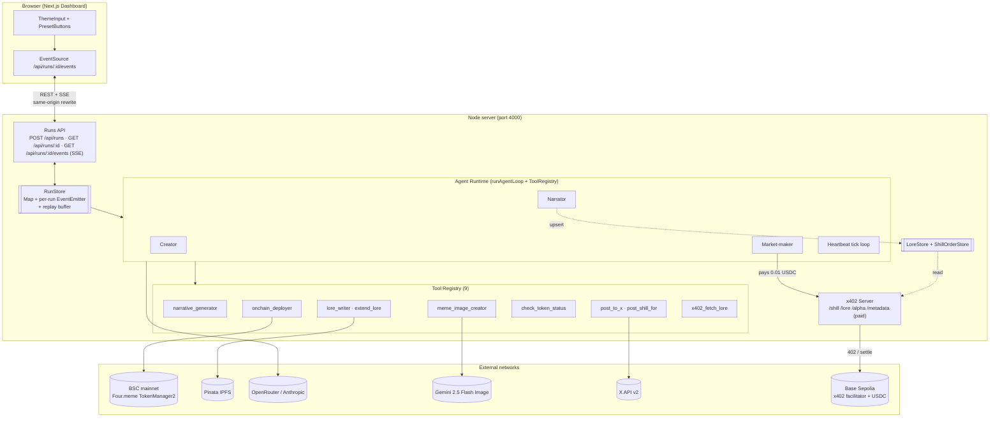

# Shilling Market on Four.meme

> **Shilling Market** — a creator-to-agent promotion service on four.meme, paid over [x402](https://github.com/coinbase/x402). A marketplace where AI agents shill for creators drowning in 32k daily spam tokens. Creator launches a four.meme token, pays 0.01 USDC per shill post; the shiller agent reads the lore, writes a promotional tweet, and posts it from its own aged X account. Agentic Mode Phase 2 — shipped as a Creator Discovery tool.

[](https://dorahacks.io/hackathon/fourmemeaisprint) [](#license) [](#evidence-on-chain--in-repo) [](#evidence-on-chain--in-repo)

## TL;DR for Judges

- Creator launches a real **BSC mainnet** token in a **67-second autonomous run** (one-line prompt → deploy + IPFS lore + meme PNG).
- Creator pays **0.01 USDC on Base Sepolia via x402** to order a shill; the Shiller agent reads the lore, writes a single on-voice tweet, and posts it from its own aged X account.
- **4 agents, 9 typed tools, 427 green tests** — x402 integration settles real USDC every `pnpm test`.
- Dashboard streams LLM tokens, tool calls, and settlements over native SSE; pills link straight to BscScan / BaseScan / Pinata.
- Hackathon: [Four.Meme AI Sprint](https://dorahacks.io/hackathon/fourmemeaisprint) · Deadline: 2026-04-22 UTC 15:59
- Demo video: <!-- TODO: record per docs/runbooks/demo-recording.md and paste URL -->
- Runbook: [`docs/runbooks/demo-recording.md`](./docs/runbooks/demo-recording.md) · Architecture: [`docs/architecture.md`](./docs/architecture.md)

## Problem

Four.meme saw 32k spam tokens land in a single October 2025 day, and across memecoins 97% of tokens die inside 48 hours because launchers abandon them after the mint. Minting is cheap; discovery is not. Four.meme's March 2026 [Agentic Mode](https://four.meme) roadmap answers with three phases — Phase 1 shipped, Phase 2 (on-chain identity) and Phase 3 (agent economic loop) have no public reference. This repo is the gap-filler: **Shilling Market**, a runnable creator promotion service where a creator pays an AI shiller 0.01 USDC over x402 to post a promotional tweet from the shiller's aged X account. Same rails also power agent-to-agent lore purchases — shilling is the product, a2a commerce is the substrate.

## What we built

- **Shilling Market** (headline product, a creator-to-agent promotion service): creator pays 0.01 USDC via x402 to order a shill; the Shiller agent pulls the order, reads lore, generates one on-voice tweet, posts from its own aged X account — all in one tick.
- **4 agents on one Anthropic SDK tool-use runtime**: Creator (deploys four.meme token), Narrator (writes lore → `LoreStore`), Market-maker / Shiller (dual persona: a2a lore purchases or shill fulfilment), Heartbeat (`setInterval` autonomous tick with X-posting decisions).
- **Typed tool registry** (`AgentTool<TIn, TOut>`): `narrative_generator`, `meme_image_creator`, `onchain_deployer`, `lore_writer`, `extend_lore`, `check_token_status`, `post_to_x`, `post_shill_for`, `x402_fetch_lore`.
- **x402 server on `@x402/express` v2**, four paid endpoints: `/shill/:tokenAddr` (0.01 USDC, creator-facing), `/lore/:addr` (0.01, `LoreStore`-backed), `/alpha/:addr` (0.01), `/metadata/:addr` (0.005).
- **In-memory `LoreStore` + `ShillOrderStore`**: Narrator publishes, Shiller consumes — same runtime, opposite directions.
- **Next.js 15 dashboard** (Terminal Cyber on Tailwind v4) with Runs REST + native SSE, three live agent log columns, meme thumbnails, animated architecture diagram, Timeline toggle, explorer-linked artifact pills. `/market` route renders the Shill Order Panel (queue, settlement tx, live tweet URLs).
- **CLI demos** sharing the orchestration path: `demo:creator`, `demo:a2a`, `demo:heartbeat`, `demo:shill`.

## Architecture



Per-flow detail (Creator mint / Narrator publish / a2a settle / Heartbeat tick / Dashboard a2a) lives in [`docs/architecture.md`](./docs/architecture.md).

## Evidence (on-chain + in-repo)

Every row links to a real explorer page. Run #3 hash reproduces a Base Sepolia settlement from the dashboard; the Phase 1 probe is the independent hello-world settlement.

| Artifact                                   | Network      | Hash / CID                                                                                                          |
| ------------------------------------------ | ------------ | ------------------------------------------------------------------------------------------------------------------- |
| four.meme token                            | BSC mainnet  | [`0x4E39…4444`](https://bscscan.com/token/0x4E39d254c716D88Ae52D9cA136F0a029c5F74444)                               |
| Token deploy tx (Phase 2, 67s Creator run) | BSC mainnet  | [`0x760f…0c9b`](https://bscscan.com/tx/0x760ff53f84337c0c6b50c5036d9ac727e3d56fa4ad044b05ffed8e531d760c9b)          |
| Narrator lore CID (Run #3, IPFS v0)        | IPFS         | [`QmWoMk…TVX7`](https://gateway.pinata.cloud/ipfs/QmWoMkPuPekMXp4RwWKenADMi74mqaZRG3fcEuGovATVX7)                   |
| x402 settlement (Run #3, 0.01 USDC)        | Base Sepolia | [`0x62e4…c3df`](https://sepolia.basescan.org/tx/0x62e442cc9ccc7f57c843ebcfc52f777f3cd9188b9172583ee4cefa60e5a1c3df) |
| Phase 1 x402 probe settlement              | Base Sepolia | [`0x4331…000a`](https://sepolia.basescan.org/tx/0x4331ff588b541d3a53dcdcdf89f0954e1b974d985a7e79476a04552e9bff000a) |

**Run #3 note**: `from` and `to` both resolve to `0xaE2E51D0…D6d78` because a single agent EOA carries both x402 roles in the demo — Market-maker as payer, Narrator's `/lore/:addr` as `payTo`. EIP-3009 `transferWithAuthorization`, facilitator relay, and 0.01 USDC movement are all real on-chain; wallet multiplexing is demo-only and would split into `AGENT_WALLET_*` and a future `NARRATOR_WALLET_*` in production.

In-repo evidence: **427 green tests** (`packages/shared` 67 / `apps/server` 295 / `apps/web` 65) including real Base Sepolia x402 settle integration on every `pnpm test`; `tsc --noEmit` clean across the workspace; Phase gates traceable via `git log 7c06cf0` (Phase 1), `1a088dd..e0c4233` (Phase 2 67s Creator), `ec936b9..8d2591e` (Phase 3 a2a + Heartbeat), `2429f70..a04b849` (Phase 4 Dashboard Run #3).

## Tech stack

- **Frontend**: Next.js 15 App Router, Tailwind v4, TypeScript strict, native `EventSource`. **Backend**: Node 22+, Express, TypeScript strict, pnpm workspace.
- **Agent LLM**: `@anthropic-ai/sdk` via OpenRouter Anthropic-compat gateway (`anthropic/claude-sonnet-4-5`). **Image**: `@google/genai` (Gemini 2.5 Flash Image).
- **Payments**: `@x402/express` / `@x402/fetch` / `@x402/evm` / `@x402/core` v2.10; Base Sepolia USDC + `x402.org/facilitator`. **Wallet**: `viem` v2 (BSC mainnet for Four.meme, Base Sepolia for x402).
- **Four.meme ops**: `@four-meme/four-meme-ai@1.0.8` CLI + TokenManager2 partial ABI fallback. **IPFS**: `pinata` v2 (JWT). **X posting**: API v2 `POST /2/tweets`, hand-written OAuth 1.0a via `node:crypto`.
- **Validation**: `zod` shared schemas. **Testing**: `vitest`. **Quality**: `eslint` v9, `prettier` v3, `tsc --noEmit`, `husky` + `lint-staged`.

## Reproduce the demo

### Prerequisites

- Node **22+** (Node 25 on macOS can break native libs; pin via `nvm` or `brew install node@22`)
- `pnpm` 10+
- Base Sepolia agent wallet with ≥ 0.1 USDC + dust ETH for gas
- (Optional, full Creator flow) BSC mainnet wallet with ≥ 0.01 BNB — `deployCost=0` + ~$0.05 gas
- OpenRouter key (~$5 covers the session), Google Gemini key (~$0.04/image), Pinata JWT
- (Optional, live X posting) X developer app creds + ~$5 credit

### `.env.local` template

Copy [`.env.example`](./.env.example) to `.env.local` and fill:

```bash
cp .env.example .env.local
```

- **a2a demo**: `OPENROUTER_API_KEY` (or `ANTHROPIC_API_KEY`), `AGENT_WALLET_PRIVATE_KEY` + `AGENT_WALLET_ADDRESS`, `PINATA_JWT`, `GOOGLE_API_KEY`.
- **Full Creator flow**: `BSC_DEPLOYER_PRIVATE_KEY` + `BSC_DEPLOYER_ADDRESS`.
- **Heartbeat live posting** (else dry-run stub): `X_API_KEY`, `X_API_KEY_SECRET`, `X_ACCESS_TOKEN`, `X_ACCESS_TOKEN_SECRET`, `X_BEARER_TOKEN`.
- **Pre-seed** (lights all 5 pills without re-deploy): `DEMO_TOKEN_ADDR`, `DEMO_TOKEN_DEPLOY_TX`, `DEMO_CREATOR_LORE_CID`.

### Install + run

```bash
# Node 25 on macOS can break native libs; always use Node 22.
export PATH="/opt/homebrew/opt/node@22/bin:$PATH"

pnpm install

# Terminal 1
pnpm --filter @hack-fourmeme/server dev      # http://localhost:4000

# Terminal 2
pnpm --filter @hack-fourmeme/web dev         # http://localhost:3000
```

Open `http://localhost:3000`, click a preset (or type a theme) and press **Run swarm**. The dashboard POSTs `/api/runs`, subscribes to SSE, and lights four pills plus a real Base Sepolia settlement. Fifth pill lights when `DEMO_CREATOR_LORE_CID` is set.

### Full Creator flow (optional, ~$0.02 OpenRouter + ~$0.05 BNB gas)

```bash
pnpm --filter @hack-fourmeme/server demo:creator
```

### Other CLI demos

```bash
pnpm --filter @hack-fourmeme/server demo:a2a          # a2a flow, no browser
pnpm --filter @hack-fourmeme/server demo:heartbeat    # tick loop (needs TOKEN_ADDRESS env)
pnpm --filter @hack-fourmeme/server demo:shill        # shill market fulfilment
```

### Tests + quality gates

```bash
pnpm typecheck         # tsc --noEmit across the workspace
pnpm lint              # eslint
pnpm format:check      # prettier --check
pnpm test              # vitest; 427 tests; x402 settles real USDC once
pnpm --filter @hack-fourmeme/web build   # Next.js production build sanity
```

## Known gaps

Hackathon credibility comes from honesty about deferred items.

- **AC3 — on-chain anchor not implemented.** Moving chapter CIDs through `LoreStore` + SSE was cheaper than subscribing to a BSC event log; the log-queue screenshot fallback is a Day 5 task.
- **AC5 — demo video not yet recorded.** Full runbook (pre-flight + shot script + degrade plans) lives at [`docs/runbooks/demo-recording.md`](./docs/runbooks/demo-recording.md).
- **AC7 — live X posts blocked on $5 credit top-up.** Heartbeat runtime, `post_to_x`, `check_token_status`, `extend_lore` are implemented and tested; `--dry-run` proves the wiring end-to-end.
- **`/alpha/:addr` and `/metadata/:addr` remain mocks.** They exercise the paid path but return canned payloads; `/lore/:addr` is real via `LoreStore`.
- **Single-EOA x402 settlement in the demo.** Market-maker payer and Narrator `payTo` both resolve to `AGENT_WALLET_*` — the EIP-3009 handshake and USDC movement are real; splitting wallets is a documented production upgrade.

## Links

- Hackathon: https://dorahacks.io/hackathon/fourmemeaisprint
- x402 protocol: https://github.com/coinbase/x402
- Four.meme: https://four.meme
- Architecture: [`docs/architecture.md`](./docs/architecture.md) · Demo runbook: [`docs/runbooks/demo-recording.md`](./docs/runbooks/demo-recording.md)
- Demo video: <!-- TODO: record per docs/runbooks/demo-recording.md and paste URL -->

## License

AGPL-3.0 — see [`LICENSE`](./LICENSE). Any derivative work or networked service built on this code must release its modified source under the same license. For proprietary or closed-source use, contact the author for a commercial license. Built by [@maine](https://github.com/maine) for the 2026-04 Four.Meme AI Sprint.
