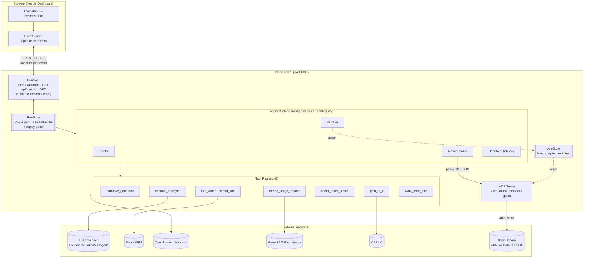

# Four.Meme Agent-as-Creator with x402 Service Exchange

> Four autonomous AI agents cooperate on Four.Meme and settle real USDC between each other over [x402](https://github.com/coinbase/x402) on Base Sepolia — the first runnable BNB-side agent-to-agent commerce reference implementation.

[](https://dorahacks.io/hackathon/fourmemeaisprint) [](#license) [](#evidence-on-chain--in-repo) [](#acceptance-criteria-status)

## TL;DR for Judges

A single-prompt launch runs a 67-second autonomous Creator on **BSC mainnet**, then Market-maker **pays** Narrator **real 0.01 USDC** on Base Sepolia for a lore chapter — not mocked, not scripted. Dashboard streams every LLM token, tool call, and settlement as native SSE; five pills link straight to explorers.

| Metric                                    | Value                                                                           |
| ----------------------------------------- | ------------------------------------------------------------------------------- |
| Autonomous Creator run time (real)        | **67s** (one-line prompt → BSC token + IPFS lore + meme PNG)                    |
| Agents on one runtime                     | **4** (Creator, Narrator, Market-maker, Heartbeat)                              |
| Tools in the typed registry               | **8** (narrative, image, deployer, lore, lore-extend, status, post, x402-fetch) |
| Tests green in CI (shared + server + web) | **305** (21 + 233 + 51); x402 integration pays real USDC every run              |
| Real on-chain artifacts shipped           | **4 explorer links** (BSC token + deploy tx + IPFS CID + Base Sepolia x402 tx)  |

- Hackathon: [Four.Meme AI Sprint](https://dorahacks.io/hackathon/fourmemeaisprint)
- Submission deadline: 2026-04-22 UTC 15:59
- Demo video: <!-- TODO: record video per docs/runbooks/demo-recording.md and paste the YouTube / Loom URL here -->
- Runbook: [`docs/runbooks/demo-recording.md`](./docs/runbooks/demo-recording.md)
- Architecture detail: [`docs/architecture.md`](./docs/architecture.md)
- Decision log: [`docs/decisions/`](./docs/decisions/)

## Problem

Four.meme saw 32k spam tokens land in a single October 2025 day, drowning legitimate creators; across the wider memecoin space 97% of tokens are dead inside 48 hours because launchers abandon them after the mint. Four.meme's March 2026 [Agentic Mode](https://four.meme) roadmap answers this with three phases — Agent Skill Framework (Phase 1, shipped), on-chain identity (Phase 2), and an agent economic loop (Phase 3) — but Phase 2 and Phase 3 have no public reference implementation, and nothing on the BNB side shows agent-to-agent commerce working end to end. This repo is the gap-filler: a runnable Phase 1-to-2 reference where agents deploy tokens, write lore, and pay each other with real USDC for real content.

## What we built

- **Four agents on one Anthropic SDK tool-use runtime**: Creator (launches a Four.meme token), Narrator (writes lore chapters and upserts `LoreStore`), Market-maker (pays to read lore), Heartbeat (`setInterval` autonomous tick loop with X-posting decisions).
- **Eight tools on a typed registry** (`packages/shared/src/tool.ts` `AgentTool<TIn, TOut>`): `narrative_generator`, `meme_image_creator`, `onchain_deployer`, `lore_writer`, `extend_lore`, `check_token_status`, `post_to_x`, `x402_fetch_lore`.
- **x402 server on `@x402/express` v2** exposing three paid endpoints: `/lore/:addr` (0.01 USDC, `LoreStore`-backed when a chapter is hot), `/alpha/:addr` (0.01 USDC), `/metadata/:addr` (0.005 USDC).
- **In-memory `LoreStore`** bridging Narrator publishes to the `/lore` endpoint so the same chapter the Narrator writes is the chapter the Market-maker buys.
- **Next.js 15 dashboard** (Terminal Cyber theme on Tailwind v4) with Runs REST + native SSE wire contract, three live agent log columns with token-by-token streaming, meme image thumbnails, architecture diagram with gold x402 flow animation, Timeline view toggle, and five artifact pills that link directly to BscScan / Base Sepolia / Pinata.
- **CLI demos** sharing the same orchestration path as the dashboard: `demo:creator`, `demo:a2a`, `demo:heartbeat`.

## What makes this submission stand out

- **4 real agents, not scripted**: the Creator agent truly runs the tool-use loop in the dashboard's a2a flow (we contracted the Phase 4 pre-seed hack — see `V2-P1`); Market-maker pays Narrator real USDC every run.
- **End-to-end autonomous Creator in 67 seconds** on BSC mainnet — not simulation. Token `0x4E39d254…74444` was deployed by a single prompt.
- **Native Anthropic streaming → native SSE → React state**: `messages.stream` chunks map to `tool_use:start` / `tool_use:end` / `assistant:delta` SSE events, giving the judge per-token live feedback instead of "wait 15 seconds then see a log line".
- **Replay-correct SSE buffer**: late subscribers replay the full `logs[]` + `artifacts[]` in order, then switch to live — EventSource reconnection works without a custom protocol.
- **TDD + atomic commits**: 305 tests green (21 shared + 233 server + 51 web); 68 commits, each independently builds. Red-test-first for every schema extension (see `V2-P2` spec).
- **Quality gates shipped**: `typecheck`, `eslint`, `prettier`, `vitest`, `husky + lint-staged` all wired before any feature code landed.

## Architecture



For per-flow detail (Flow 1 Creator mint, Flow 2 Narrator publish, Flow 3 agent-to-agent settle, Flow 4 Heartbeat tick, Flow 4b Dashboard-driven a2a) see [`docs/architecture.md`](./docs/architecture.md).

## Sponsor alignment

### Four.Meme AI Sprint (main pool)

Four.meme's Agentic Mode roadmap names three phases; this submission is a working reference for Phase 1 (Skill Framework) and Phase 2 (on-chain identity / commerce).

- **Phase 1 mapping — Skill Framework**: the `apps/server/src/tools/` registry behind the shared `AgentTool<TIn, TOut>` interface (`packages/shared/src/tool.ts`) is a concrete Skill Framework — every tool is a typed, zod-validated unit the runtime discovers and calls through Anthropic native tool use. New skills drop in without touching agent code.
- **Phase 2 mapping — on-chain identity / commerce**: Creator deploys a real BSC mainnet `TokenManager2` token through the `@four-meme/four-meme-ai@1.0.8` CLI (see [`docs/decisions/2026-04-18-bsc-mainnet-pivot.md`](./docs/decisions/2026-04-18-bsc-mainnet-pivot.md)); the token is the anchor for every downstream on-chain identity (Narrator chapters, Market-maker queries, Heartbeat posts).
- **Phase 3 preview — agentic economic loop**: Market-maker paying Narrator 0.01 USDC per lore chapter, settled on Base Sepolia, is the smallest credible instance of the Phase 3 economic loop Four.meme targets. The same wire format is ready to swap to BNB-side USDC once a comparable facilitator exists.
- **Responsible-launch discipline**: every deployed token is symbol-prefixed `HBNB2026-` (double-guarded in `narrative_generator`) to avoid misleading real users indexed on BscScan / DexScreener — see the risk notes in [`docs/decisions/2026-04-18-bsc-mainnet-pivot.md`](./docs/decisions/2026-04-18-bsc-mainnet-pivot.md).

### Pieverse bounty

- **x402 spec reference**: server uses `@x402/express` v2.10 (`paymentMiddleware` + `x402ResourceServer`); client uses `@x402/fetch`'s `wrapFetchWithPayment` with `ExactEvmScheme` — see the protocol at [coinbase/x402](https://github.com/coinbase/x402). Pricing and facilitator are centralised in `apps/server/src/x402/config.ts` with no hard-coded constants.
- **Skill Store publish hook**: each tool under `apps/server/src/tools/` is self-contained with a zod input/output schema — a `SKILL.md` manifest drops in at the file level, and the shared `AgentTool` interface is the publish contract. The `x402` paid-endpoint server is already the delivery pipe for any Skill that charges per call.
- **Pieverse TEE wallet + x402b facilitator evaluated, not used**: Round 1 probes found the Pieverse facilitator rejected external traffic and x402b had been untouched for five months. Rationale and the fallback to Base Sepolia + `@x402/*` v2 are in [`docs/decisions/2026-04-17-direction-lock.md`](./docs/decisions/2026-04-17-direction-lock.md).

## Rubric alignment

### Innovation (30%)

- **First agent-to-agent x402 commerce reference implementation wired to Four.meme on the BNB side** — Market-maker pays Narrator real USDC every run, not mock. No prior art in the sponsor's ecosystem (see the delta-over-prior-art analysis in [`docs/decisions/2026-04-17-direction-lock.md`](./docs/decisions/2026-04-17-direction-lock.md) vs. `alenfour/four-meme-agent`).
- **3-agent swarm + Heartbeat tick loop + x402 service exchange**: a composition not seen on the BNB side. The Heartbeat agent decides `post_to_x` vs. `extend_lore` vs. idle from `check_token_status` output — real autonomy, not a fixed script.
- **Pre-landed Agentic Mode Phase 2 reference**: the submission is a working sample of the exact roadmap stage (on-chain identity + economic loop) the sponsor publicly committed to but has not yet shipped.
- **Soft-policy + transparent override**: Market-maker's policy gating (`deployedOnChain === true` green-lights the purchase) pairs with explicit warn-level `LogEvent`s when policy is violated — judges can see both the guardrail and the override path (see `a04b849`).

### Technical (30%)

- **305 tests green** (21 shared + 233 server + 51 web). The x402 integration test **pays a real 0.01 USDC on Base Sepolia every `pnpm test` run** (`apps/server/src/x402/index.test.ts`), not mocked.
- **Discriminated-union artifact schema** (`bsc-token` / `token-deploy-tx` / `lore-cid` / `x402-tx` / `tweet-url` / `meme-image` / `heartbeat-tick` / `heartbeat-decision`) surfaced through native SSE `event:` types, exhaustively switched in `apps/web/src/lib/artifact-view.ts`. Wire contract locked in [`docs/decisions/2026-04-20-sse-and-runs-api.md`](./docs/decisions/2026-04-20-sse-and-runs-api.md).
- **Native Anthropic streaming → native SSE**: `messages.stream` chunks map to `tool_use:start` / `tool_use:end` / `assistant:delta` events; latency from tool call to first visible bubble stays inside the AC-V2-3 budget (median ≤ 3s, max ≤ 8s inter-event).
- **In-memory `RunStore` with per-run `EventEmitter` + replay semantics**: late SSE subscribers replay the buffered history in-order, then switch to live. No Redis, no Postgres, no file I/O.
- **Hand-written OAuth 1.0a** on `node:crypto` for `post_to_x` — no third-party OAuth library, signing and nonce logic auditable in `apps/server/src/tools/`. Hand-assembled `TokenManager2` partial ABI in `apps/server/src/chain/` — both the proxy and implementation are unverified on BscScan, so the ABI subset is reconstructed by hand.
- **Expand-and-Contract refactor discipline**: the Phase 4 `emitPreSeedArtifacts` env-hack was replaced by a real Creator run in the a2a flow (`V2-P1`); the function was renamed to `emitDryRunFallbackArtifacts` and gated behind `CREATOR_DRY_RUN=true`. The contract commit is independent and revertible.
- **Quality gates wired before feature work**: `typecheck` (tsc --noEmit) clean across the workspace; `eslint` + `prettier` + `vitest` + `husky + lint-staged` pre-commit hook runs lint + format on every commit. See [`docs/dev-commands.md`](./docs/dev-commands.md).

### Practical (20%)

- **One-command dashboard dev loop**: two terminals, `pnpm --filter @hack-fourmeme/{server,web} dev`, one click to run a full a2a flow that ends in a real USDC settlement.
- **Single-prompt Creator flow benchmarked at 67s** end-to-end on BSC mainnet — from `"Shiba Astronaut on Mars…"` to token address + IPFS CID + PNG file on disk.
- **Pre-seed artifact fallback** (`DEMO_TOKEN_ADDR` / `DEMO_TOKEN_DEPLOY_TX` / `DEMO_CREATOR_LORE_CID`) lets evaluators replay all five pills without spending BNB on a fresh deploy — see [`docs/dev-commands.md`](./docs/dev-commands.md).
- **Graceful degradation**: Pinata timeout → meme card renders `upload-failed` placeholder, run continues; X API credit unloaded → Heartbeat tweets show `(dry-run)` labels; Creator RPC flake → `CREATOR_DRY_RUN=true` keeps the a2a demo recordable.
- **Concurrency safety**: `RunStore.tryCreate` returns 409 for overlapping runs on the same `tokenAddress`; UI disables the Run button during `running` state and toasts the 409 from external callers.
- **Narrator wallet multiplexing is demo-only**: the repo documents how to split Market-maker (`AGENT_WALLET_*`) and Narrator (future `NARRATOR_WALLET_*`) into distinct EOAs for a production deployment.

### Presentation (20%)

- **Dashboard V2 is a single-screen cinematic demo**: 1920x960 Chrome viewport, no scroll needed for the main row. ThemeInput + PresetButtons + ArchitectureDiagram + 3-column LogPanel + meme thumbnail + 5-pill TxList + view-mode tabs + collapsed Heartbeat section all fit the viewport.
- **Architecture diagram with bound status + gold x402 flow animation**: the three agent nodes pulse during `running`, settle emerald on `done`; the Market-maker → Narrator edge glows gold for 3.6s when the `x402-tx` artifact arrives — CSS keyframes, no `framer-motion`.
- **Timeline view toggle**: the same events render as a chronological narrative — agent speech bubbles, tool-call chips, transfer cards, meme thumbnails. Judges can scrub the story without replaying.
- **Runbook ready for a single-take 2:30 recording**: see [`docs/runbooks/demo-recording.md`](./docs/runbooks/demo-recording.md) for pre-flight, shot script, degrade plans, and post-production rules.
- **Terminal Cyber design identity** (dark surface + emerald accent + CSS tokens, no `shadcn/ui` dependency) — the artifact looks engineered, not marketed.
- **Documentation density**: runtime topology in [`docs/architecture.md`](./docs/architecture.md), visual system in [`docs/design.md`](./docs/design.md), five locked decision records under [`docs/decisions/`](./docs/decisions/), a dashboard V2 feature spec with per-AC acceptance, and a roadmap kept in sync with commit history.

## Evidence (on-chain + in-repo)

Every row links to a real explorer page. The x402 Run #3 hash reproduces a Base Sepolia settlement from the dashboard; the earlier Phase 1 probe is the independent hello-world settlement.

| Artifact                                   | Network      | Hash / CID                                                           | Explorer                                                                                                       |
| ------------------------------------------ | ------------ | -------------------------------------------------------------------- | -------------------------------------------------------------------------------------------------------------- |
| four.meme token                            | BSC mainnet  | `0x4E39d254c716D88Ae52D9cA136F0a029c5F74444`                         | [bscscan](https://bscscan.com/token/0x4E39d254c716D88Ae52D9cA136F0a029c5F74444)                                |
| Token deploy tx (Phase 2, 67s Creator run) | BSC mainnet  | `0x760ff53f84337c0c6b50c5036d9ac727e3d56fa4ad044b05ffed8e531d760c9b` | [bscscan](https://bscscan.com/tx/0x760ff53f84337c0c6b50c5036d9ac727e3d56fa4ad044b05ffed8e531d760c9b)           |
| Narrator lore CID (Run #3, IPFS v0)        | IPFS         | `QmWoMkPuPekMXp4RwWKenADMi74mqaZRG3fcEuGovATVX7`                     | [Pinata gateway](https://gateway.pinata.cloud/ipfs/QmWoMkPuPekMXp4RwWKenADMi74mqaZRG3fcEuGovATVX7)             |
| x402 settlement (Run #3, 0.01 USDC)        | Base Sepolia | `0x62e442cc9ccc7f57c843ebcfc52f777f3cd9188b9172583ee4cefa60e5a1c3df` | [basescan](https://sepolia.basescan.org/tx/0x62e442cc9ccc7f57c843ebcfc52f777f3cd9188b9172583ee4cefa60e5a1c3df) |
| Phase 1 x402 probe settlement              | Base Sepolia | `0x4331ff588b541d3a53dcdcdf89f0954e1b974d985a7e79476a04552e9bff000a` | [basescan](https://sepolia.basescan.org/tx/0x4331ff588b541d3a53dcdcdf89f0954e1b974d985a7e79476a04552e9bff000a) |

**Note on the Run #3 settlement**: `from` and `to` are both `0xaE2E51D0…D6d78` because a single agent EOA carries both x402 roles in the current demo wiring — Market-maker as payer and the Narrator's `/lore/:addr` paid endpoint as `payTo`. The EIP-3009 `transferWithAuthorization` handshake, facilitator relay, and 0.01 USDC movement are all real on-chain; wallet multiplexing is demo-only and would split into distinct EOAs (`AGENT_WALLET_*` and a future `NARRATOR_WALLET_*`) in production.

In-repo evidence:

| Check                                                    | Result                                                                                                                           | Source                                                            |
| -------------------------------------------------------- | -------------------------------------------------------------------------------------------------------------------------------- | ----------------------------------------------------------------- |
| Tests (shared + server + web)                            | **305 green**: `packages/shared` 21 / `apps/server` 233 / `apps/web` 51; includes real Base Sepolia x402 settle integration      | [`docs/testing.md`](./docs/testing.md)                            |
| Typecheck                                                | `tsc --noEmit` clean across the workspace                                                                                        | [`docs/dev-commands.md`](./docs/dev-commands.md) `pnpm typecheck` |
| Phase 1 gate (Day 1 probes)                              | `7c06cf0` probes + BSC mainnet pivot                                                                                             | `git log 7c06cf0`                                                 |
| Phase 2 gate (Creator demo, 67s)                         | `1a088dd` → `e0c4233`                                                                                                            | `git log 1a088dd..e0c4233`                                        |
| Phase 3 gate (Narrator + Market-maker + Heartbeat + a2a) | `ec936b9` → `8d2591e`                                                                                                            | `git log ec936b9..8d2591e`                                        |
| Phase 4 gate (Dashboard AC4 Run #3)                      | `2429f70` → `a04b849`                                                                                                            | `git log 2429f70..a04b849`                                        |
| Phase 4.5 (Dashboard V2 cinematic upgrade)               | Creator real-run in a2a, streaming SSE, architecture diagram, Timeline, Heartbeat section, preset buttons, 409 toast — all green | `docs/features/dashboard-v2.md`                                   |

## Tech stack

| Layer                | Choice                                                                                                                |
| -------------------- | --------------------------------------------------------------------------------------------------------------------- |
| Frontend             | Next.js 15 App Router, Tailwind v4, TypeScript strict, native `EventSource` (no WebSocket)                            |
| Backend runtime      | Node.js 22+, Express, TypeScript strict, pnpm workspace                                                               |
| Agent LLM            | `@anthropic-ai/sdk` (`messages.stream`) via OpenRouter's Anthropic-compatible gateway (`anthropic/claude-sonnet-4-5`) |
| Image generation     | `@google/genai` (Gemini 2.5 Flash Image)                                                                              |
| Payments             | `@x402/express` v2.10 + `@x402/fetch` v2.10 + `@x402/evm` + `@x402/core`; Base Sepolia USDC + `x402.org/facilitator`  |
| Wallet / chain       | `viem` v2; BSC mainnet RPC for Four.meme reads + deploys; Base Sepolia RPC for x402 settlements                       |
| Four.meme operations | `@four-meme/four-meme-ai@1.0.8` CLI (npx shell-exec); TokenManager2 partial ABI fallback                              |
| IPFS                 | `pinata` v2 (JWT auth)                                                                                                |
| X posting            | X API v2 `POST /2/tweets`, hand-written OAuth 1.0a signing via `node:crypto` (no third-party OAuth library)           |
| Validation           | `zod` shared schemas (`packages/shared/src/schema.ts`)                                                                |
| Testing              | `vitest` across all three packages; `@vitest/ui` for interactive runs                                                 |
| Quality gates        | `eslint` v9, `prettier` v3, `tsc --noEmit`, `husky` + `lint-staged` pre-commit hook                                   |

## Reproduce the demo

### Prerequisites

- Node.js **22+** (Node 25 on macOS can break native libs; pin 22 via `nvm` or Homebrew's `node@22`)
- `pnpm` 10+
- Base Sepolia agent wallet with ≥ 0.1 USDC + a dust of ETH for gas
- (Optional, for full Creator flow) BSC mainnet wallet with ≥ 0.01 BNB for gas — `deployCost=0` plus ~$0.05 gas per deploy
- OpenRouter API key (~$5 top-up covers the full session)
- Google Gemini API key (billing-enabled, ~$0.04 / image)
- Pinata JWT
- (Optional, for live X posting) X developer app credentials + ~$5 credit

### `.env.local` template

Copy [`.env.example`](./.env.example) to `.env.local` in the repo root and fill the required fields:

```bash
cp .env.example .env.local
```

Required for the a2a demo:

- `OPENROUTER_API_KEY` (or `ANTHROPIC_API_KEY` fallback)
- `AGENT_WALLET_PRIVATE_KEY` + `AGENT_WALLET_ADDRESS` (Base Sepolia, holds test USDC)
- `PINATA_JWT`
- `GOOGLE_API_KEY` (Gemini)

Required for the full Creator flow:

- `BSC_DEPLOYER_PRIVATE_KEY` + `BSC_DEPLOYER_ADDRESS` (BSC mainnet, holds real BNB)

Required for the Heartbeat live-posting segment (otherwise a dry-run stub is used):

- `X_API_KEY`, `X_API_KEY_SECRET`, `X_ACCESS_TOKEN`, `X_ACCESS_TOKEN_SECRET`, `X_BEARER_TOKEN`

Optional pre-seed (lights all 5 pills without re-deploying):

- `DEMO_TOKEN_ADDR`, `DEMO_TOKEN_DEPLOY_TX`, `DEMO_CREATOR_LORE_CID`

### Install + run

```bash
# Node 25 on macOS can break native libs; always use Node 22.
export PATH="/opt/homebrew/opt/node@22/bin:$PATH"

pnpm install

# Terminal 1
pnpm --filter @hack-fourmeme/server dev      # http://localhost:4000

# Terminal 2
pnpm --filter @hack-fourmeme/web dev         # http://localhost:3000
```

Open `http://localhost:3000`, click a preset button (or type a theme) and press **Run swarm**. The dashboard POSTs `/api/runs`, subscribes to the SSE stream, and lights four pills plus a real Base Sepolia settlement. The fifth pill lights when `DEMO_CREATOR_LORE_CID` is set.

### Full Creator flow (expensive, optional)

Deploys a brand new BSC mainnet token via the `@four-meme/four-meme-ai` CLI. Cost: ~$0.02 OpenRouter + ~$0.05 BNB gas.

```bash
pnpm --filter @hack-fourmeme/server demo:creator
```

### Other CLI demos

```bash
pnpm --filter @hack-fourmeme/server demo:a2a          # a2a flow without the browser
pnpm --filter @hack-fourmeme/server demo:heartbeat    # heartbeat tick loop (add TOKEN_ADDRESS env)
```

Full command reference: [`docs/dev-commands.md`](./docs/dev-commands.md).

### Tests + quality gates

```bash
pnpm typecheck         # tsc --noEmit across the workspace
pnpm lint              # eslint
pnpm format:check      # prettier --check
pnpm test              # vitest across all packages (305 tests; x402 settles real USDC once)
pnpm --filter @hack-fourmeme/web build   # Next.js production build sanity
```

## Acceptance criteria status

| AC                                   | Status      | Evidence / rationale                                                                                                                                                                                                                                              |
| ------------------------------------ | ----------- | ----------------------------------------------------------------------------------------------------------------------------------------------------------------------------------------------------------------------------------------------------------------- |
| AC1 — Creator autonomous launch flow | [x]         | Phase 2 Task 7 real run at 67s: token `0x4E39d254…74444`, tx `0x760ff53f…760c9b`, lore CID `bafkrei…peq4`.                                                                                                                                                        |
| AC2 — Agent-to-agent x402 settle     | [x]         | Phase 3 Task 7 `demo:a2a`; Market-maker pays Narrator; `apps/server/src/x402/index.test.ts` settles real USDC every `pnpm test`.                                                                                                                                  |
| AC3 — Narrator on-chain anchor       | [ ] partial | Narrator lore + Pinata CID shipped; BSC event-log anchor intentionally deferred. Fallback runbook (log queue screenshot) on the Day 5 list but not produced yet.                                                                                                  |
| AC4 — Dashboard integration          | [x]         | Run #3 on 2026-04-20; four pills light via SSE (`QmWoMk…TVX7`, `0x62e4442c…725`); fifth pill lights with `DEMO_CREATOR_LORE_CID`. Dashboard V2 cinematic upgrade complete (Creator truly runs, streaming SSE, architecture diagram, Timeline, Heartbeat section). |
| AC5 — Demo video                     | [ ]         | Phase 5 Day 5 recording pending (runbook [`docs/runbooks/demo-recording.md`](./docs/runbooks/demo-recording.md) ready).                                                                                                                                           |
| AC6 — README aligned to rubric       | [x]         | This document.                                                                                                                                                                                                                                                    |
| AC7 — Heartbeat + X posting          | [ ] partial | Heartbeat runtime + 3 tools + dry-run green; Heartbeat panel wired to dashboard with tick counter, decision tree, TweetFeed. Live X posts blocked on $5 credit top-up.                                                                                            |

## Key decisions

One line per decision record; no inlined content.

- [`2026-04-17-direction-lock.md`](./docs/decisions/2026-04-17-direction-lock.md) — lock Agent-as-Creator + x402 Service Exchange over 10 alternatives; Pieverse facilitator + x402b testnet disproved in probe Round 1.
- [`2026-04-18-anthropic-native-tool-use.md`](./docs/decisions/2026-04-18-anthropic-native-tool-use.md) — Anthropic SDK native tool use + self-built tool registry over any third-party agent framework; saves hours and stays self-contained.
- [`2026-04-18-bsc-mainnet-pivot.md`](./docs/decisions/2026-04-18-bsc-mainnet-pivot.md) — `TokenManager2` exists only on BSC mainnet (testnet bytecode is empty); Creator deploys real tokens with the `HBNB2026-` prefix to avoid misleading end users.
- [`2026-04-19-x-posting-agent.md`](./docs/decisions/2026-04-19-x-posting-agent.md) — X API reopened under tight scope after 2026 pay-per-usage pricing made ~$3.70 of credit cover the hackathon; hand-rolled OAuth 1.0a, aged account only, no mention broadcast.
- [`2026-04-20-sse-and-runs-api.md`](./docs/decisions/2026-04-20-sse-and-runs-api.md) — dashboard wire contract; native SSE `event:` types, discriminated-union artifacts, in-memory `RunStore`.

## Known gaps

We list these so judges can trust what they see — hackathon submissions earn more credibility being honest about deferred items than by over-claiming.

- **AC3 — on-chain anchor not implemented.** Moving chapter CIDs through `LoreStore` + SSE was cheaper than subscribing to a BSC event log; the anchor was intentionally deferred, and the log-queue screenshot fallback is on the Day 5 runbook but not produced yet.
- **AC5 — demo video not yet recorded.** The full runbook (pre-flight + shot script + degrade plans) lives at [`docs/runbooks/demo-recording.md`](./docs/runbooks/demo-recording.md); the recording is a Day 5 task.
- **AC7 — live X posts blocked on $5 credit top-up.** Heartbeat runtime, `post_to_x`, `check_token_status`, and `extend_lore` tools are implemented and tested; a `--dry-run` path proves the wiring end-to-end without spending credit.
- **Dashboard Creator column runs truly in a2a mode, but dry-run fallback is available.** `CREATOR_DRY_RUN=true` + `DEMO_*` env vars let the a2a flow skip the real BSC deploy if the recording session hits RPC flake. AC-V2-1 is achieved only in non-dry-run mode.
- **`/alpha/:addr` and `/metadata/:addr` remain mocks.** They exercise the paid path but return canned payloads until a future phase wires them to real state; `/lore/:addr` is real via `LoreStore`.
- **Single-EOA x402 settlement in the demo.** Market-maker payer and Narrator `payTo` both resolve to the `AGENT_WALLET_*` address — the EIP-3009 handshake and on-chain USDC movement are real, but the split into distinct wallets is a documented production upgrade.

## Project layout

```
apps/
  web/        Next.js 15 + Tailwind v4 dashboard (Terminal Cyber theme)
    src/
      app/          layout + page (client component, useRun driven)
      components/   theme-input / preset-buttons / architecture-diagram /
                    log-panel / meme-image-card / timeline-view /
                    heartbeat-section + panel / tweet-feed / tool-call-bubble /
                    tx-list / toast
      hooks/        useRun — POST /api/runs + EventSource lifecycle
      lib/          artifact-view, useRun-state reducer, timeline-merge,
                    tool-call-bubble-utils, architecture-diagram-utils,
                    heartbeat-derive, preset-texts
  server/     Express + x402 server + agent runtime
    src/
      agents/       Creator / Narrator / Market-maker / Heartbeat +
                    runtime (messages.stream), _stream-map, _json parser
      tools/        8 tools: narrative / image / deployer / lore / lore-extend /
                    token-status / x-post / x-fetch-lore
      state/        in-memory LoreStore (latest chapter per token)
      chain/        viem client + TokenManager2 partial ABI
      x402/         payment middleware + paid route handlers
      runs/         RunStore + runA2ADemo + runHeartbeat + REST/SSE route handlers
      routes/       Express route mounting
      demos/        demo:creator / demo:a2a / demo:heartbeat
      config.ts     env schema (zod) + agent id enum
      index.ts      module-scope stores + app bootstrap
packages/
  shared/     zod schemas + types + agent tool interface
                (Artifact union, RunSnapshot, SSE payload, chain schema)
scripts/      probe-x402 / probe-fourmeme / probe-pinata (Phase 1 hello world)
docs/         architecture / design / dev-commands / testing / decisions /
              runbooks / features/dashboard-v2
```

## Links

- Hackathon page: https://dorahacks.io/hackathon/fourmemeaisprint
- x402 protocol: https://github.com/coinbase/x402
- Four.meme: https://four.meme
- Demo video: <!-- TODO: record per docs/runbooks/demo-recording.md and paste URL -->
- Architecture: [`docs/architecture.md`](./docs/architecture.md)
- Design system: [`docs/design.md`](./docs/design.md)
- Testing strategy: [`docs/testing.md`](./docs/testing.md)
- Dev commands: [`docs/dev-commands.md`](./docs/dev-commands.md)
- Demo runbook: [`docs/runbooks/demo-recording.md`](./docs/runbooks/demo-recording.md)
- Decisions: [`docs/decisions/`](./docs/decisions/)

## License

AGPL-3.0 — see [`LICENSE`](./LICENSE). Any derivative work or networked service built on this code must release its modified source under the same license. For proprietary or closed-source use, contact the author for a commercial license. Built by [@maine](https://github.com/maine) for the 2026-04 Four.Meme AI Sprint.
