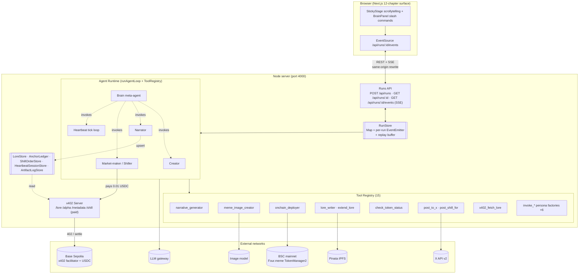

# Memind

> **Every memecoin gets a brain. And a wallet.**
>
> _Memind = meme + mind. On Four.meme._

> **Every memecoin gets its own Memind: a runtime with persistent memory, pluggable personas, and on-chain-paid autonomy.** One Memind (each Memind is internally a **Brain runtime**), four personas plus a Brain meta-agent, paid over [x402](https://github.com/coinbase/x402). The **Creator persona** deploys a real BSC mainnet token and writes chapter 1 of its **lore** (the token's AI-generated origin codex). The **Narrator persona** reads chapter 1 and continues to chapter 2. Every chapter is served from an x402-paid endpoint so other personas (and other Meminds) pay 0.01 USDC to read it as alpha. The **Market-maker persona** runs in two modes: as Market-maker it pays Narrator for lore to drive its decisions; as **Shiller** it uses the same lore to draft on-voice tweets creators commission at 0.01 USDC each, posted from a real aged X account. The **Heartbeat persona** ticks every 60s, deciding on its own when to extend lore, post, or idle. The **Brain meta-agent** sits on top and dispatches to any of the above when a human talks to the Memind through the BrainPanel. **Paid shilling is the first shipped SKU; Launch Boost, Community Ops, Alpha Feed (all sell-side) plug into the same Memind next. No new runtime, just new personas.**

[](https://dorahacks.io/hackathon/fourmemeaisprint) [](#license) [](#evidence-on-chain--in-repo)

## TL;DR

- **The thesis**: memecoins die in 48 hours because creators abandon them after mint. We give every token a **Memind** that takes over the long-term narrative and trades services with other Meminds — a self-sustaining agent-to-agent free market where Narrators sell lore, Shillers sell tweets, Heartbeats decide what to do next. **Lifecycle extends from 48 hours to months. Creator only mints; the Memind runs the rest.**
- **The loop**: the Memind's Creator persona deploys a real BSC mainnet token in **67s** and writes lore chapter 1 → Narrator persona continues chapter 2 → Market-maker persona pays 0.01 USDC on Base Sepolia via x402 to read lore as alpha → the same Market-maker persona switches to Shiller mode to post an on-voice tweet from a real aged X account when the creator commissions one → Heartbeat persona ticks on its own and decides what the Memind does next.
- **Why this is a market, not a feature**: x402 settlement turns every inter-persona call into a USDC-priced trade. Market-maker pays Narrator 0.01 USDC to read lore. Creator pays Shiller 0.01 USDC to post tweets. Add more sell-side SKUs (Launch Boost, Community Ops, Alpha Feed) — they all buy the same lore, settle through the same rail, price-discover against each other. `Persona<TInput, TOutput>` is the interface; the market is the economic primitive.
- **1 Memind (Brain runtime), 4 personas + Brain meta-agent, 15 typed tools, 1168 green tests.** x402 integration settles real USDC every `pnpm test`. LoreStore is a per-token chapter chain (history, not just latest) — the token's memory persists across runs. Heartbeat tick bubbles surface the LLM's chosen action + reason, so autonomous decisions are visible, not silent. Shiller tweets support a toggleable four.meme click-through URL (default off during X's 7-day post-OAuth cooldown; toggle on post-cooldown for attribution).
- **Product-grade surface**: 12-chapter sticky-stage scrollytelling (Hero → Problem → Solution → Brain Architecture → Launch Demo → Shill Demo → Saga → Heartbeat → Take Rate → SKU Matrix → Phase Map → Evidence). TopBar `BrainIndicator` streams the live run state; a right-side `<BrainPanel>` slides in a conversational surface with ten slash commands (`/launch /order /lore /heartbeat /heartbeat-stop /heartbeat-list /status /help /reset /clear`). Background heartbeat ticks push live into the chat as dedicated bubbles via a dedicated SSE stream (`/api/heartbeats/:addr/events`). The Evidence chapter hydrates from Postgres on page refresh, so on-chain pills survive reloads. Engineering detail (logs / artifacts / console) lives in a `D`-to-open `<LogsDrawer>`. Product-first up-front, engineer-deep on demand.
- Hackathon: [Four.Meme AI Sprint](https://dorahacks.io/hackathon/fourmemeaisprint)
- Architecture: [`docs/architecture.md`](./docs/architecture.md)

## Problem

Four.meme saw [32k spam tokens land in a single day in October 2025](https://coinspot.io/en/cryptocurrencies/four-meme-increased-the-token-launch-fee-to-fight-spam-and-toxic-memes/), and across memecoins [97% eventually die](https://chainplay.gg/blog/state-of-memecoin-2024/) because launchers abandon them after the mint. Minting is cheap; **discovery is not**. Four.meme's [March 2026 AI Agent roadmap](https://phemex.com/news/article/fourmeme-reveals-ai-agent-roadmap-for-bnb-chain-integration-63946) answers with three phases: **Phase 1 — Agent Skill Framework** (live); **Phase 2 — Executable AI Agents with LLM Chat**; **Phase 3 — Agentic Mode** (on-chain AI identities). **Phase 2 has no public reference implementation. This repo is one.** Phase 3 — our planned implementation path of BAP-578 NFA + TEE wallet + ERC-8004 reputation — is roadmapped, not shipped; see the [wallet custody FAQ entry](#faq) below. **What we ship today is the economic loop Phase 3 will sit on top of: a working agent-to-agent market with real USDC settlement.**

## How it works: the agent commerce loop

Every memecoin should have a **soul**, not just a contract address. We give each token a **Memind**; inside that Memind, four personas collaborate around the lore — Creator and Narrator supply it, Market-maker pays for it (or switches to Shiller mode for creator-commissioned tweets), and Heartbeat autonomously decides the token's next move.

**Lore** = the AI-generated origin codex of a token. Think of it as Pokémon card back-story, NFT collection world-building, or MMO world-codex, but for a memecoin: split into numbered chapters, pinned to IPFS, and served from a paid x402 endpoint.

```
┌──────────────┐  writes  ┌──────────────┐  extends  ┌──────────────┐
│ Creator      │ ───ch1──►│  LoreStore   │◄───ch2──── │ Narrator     │
│ (supply)     │          │  (IPFS CIDs) │            │ (supply)     │
└──────┬───────┘          └──────┬───────┘            └──────────────┘
       │ deploys                 │ served by
       ▼                         ▼
┌──────────────┐          ┌─────────────────┐      ┌──────────────┐
│ BSC mainnet  │          │ x402 /lore/:addr│◄─pays│ Market-maker │
│ four.meme    │          │ 0.01 USDC       │  USDC│ (demand)     │
│ TokenManager │          └─────────────────┘  via └──────────────┘
└──────────────┘                  ▲            x402
                                  │ reads same lore
                         ┌────────┴────────┐       ┌──────────────┐
                         │ Shiller persona │◄─pays─│ Creator      │
                         │ (demand, $SKU1) │  0.01 │ (human via   │
                         │ posts on X      │  USDC │  /market)    │
                         └─────────────────┘       └──────────────┘
```

Three observations that make this a **primitive** rather than a one-off app:

1. **Same lore, multiple buyers.** Market-maker and Shiller both pay to read the identical chapter. Add more sell-side SKUs (Launch Boost, Community Ops, Alpha Feed) and they all share the lore substrate. Zero new infrastructure.
2. **Same rail, multiple payers.** x402 settles from agents (Market-maker paying Narrator) or from humans (Creator paying the Shiller) through the exact same EIP-3009 / Base Sepolia USDC flow.
3. **Same tweet, real click-through (opt-in).** Shiller tweets lead with `$SYMBOL`. When `includeFourMemeUrl=true` they also end with `https://four.meme/token/0x...` — a live backlink to four.meme. The flag defaults to off during X's 7-day post-OAuth cooldown and flips on once the cooldown clears, so every tweet is attribution-ready without risking the aged account's trust score.

## What we built

- **Agent commerce primitive**: the four-persona loop above, fully wired inside one Memind. `Creator` + `Narrator` sit on the supply side (write + extend lore); `Market-maker` sits on the demand side in two modes — reads lore as alpha (a2a), or turns the same lore into creator-commissioned tweets as Shiller; `Heartbeat` ticks autonomously once the commerce loop is live. A **Brain meta-agent** dispatches to any of the four via `invoke_*` tool factories when the user talks to the Memind through the BrainPanel.
- **Paid shilling (SKU 1, shipped).** Creator hits `/order <tokenAddr> [brief]` from BrainPanel (or `pnpm demo:shill` from the CLI); the server settles 0.01 USDC via x402 on Base Sepolia, enqueues the order, and the Shiller persona posts a real tweet from an aged X account within ~6 seconds. Click-through back to `four.meme/token/<addr>`.
- **4 personas + Brain meta-agent on one tool-use runtime (one Memind = one Brain runtime per memecoin)**: Creator / Narrator / Market-maker (dual-mode: a2a lore buyer or creator-paid Shiller) / Heartbeat (`setInterval` autonomous tick) / Brain (meta-agent that dispatches to the others).
- **Typed tool registry** (`AgentTool<TIn, TOut>`, 15 total): nine domain tools (`narrative_generator`, `meme_image_creator`, `onchain_deployer`, `lore_writer`, `extend_lore`, `check_token_status`, `post_to_x`, `post_shill_for`, `x402_fetch_lore`) plus six Brain meta-agent factories — four persona dispatchers (`invoke_creator`, `invoke_narrator`, `invoke_shiller`, `invoke_heartbeat_tick`) and two heartbeat-session managers (`stop_heartbeat`, `list_heartbeats`).
- **x402 server on `@x402/express` v2**, four paid endpoints (paths + prices in `apps/server/src/x402/config.ts`): `GET /lore/:addr` ($0.01, `LoreStore`-backed), `GET /alpha/:addr` ($0.01, mock payload), `GET /metadata/:addr` ($0.005, mock payload), `POST /shill/:tokenAddr` ($0.01, creator-paid; enqueues a Shiller order).
- **Postgres-backed state**: `LoreStore` (per-token chapter chain, not just latest), `AnchorLedger`, `ShillOrderStore`, `HeartbeatSessionStore`, and `ArtifactLogStore` all persist through a shared pg pool. Counters survive process restarts; `ensureSchema` resets any ghost `running=true` heartbeat rows at boot so the UI never shows phantom loops.
- **Live heartbeat loop**: `/heartbeat <addr> <ms> [maxTicks]` starts a real `setInterval`-driven background session (default cap 5 ticks to keep a production demo from farming API budget); `/heartbeat-list` reports which tokens are still pulsing, `/heartbeat-stop` kills one. Every tick fans out through an in-process event bus → SSE endpoint → dedicated `heartbeat` chat bubble with the tweet URL or IPFS CID the persona produced.
- **Next.js 15 product surface** (Terminal Cyber on Tailwind v4 + `motion@12`): a single sticky viewport cross-fades between 12 chapters (Hero → Problem → Solution → Brain Architecture → Launch Demo → Shill Demo → Saga → Heartbeat → Take Rate → SKU Matrix → Phase Map → Evidence). `Saga` (Ch7) renders the Narrator persona's think → write → pin cycle as its own scene. `Evidence` (Ch12) hydrates from a Postgres-backed artifact log on page refresh, so every on-chain pill survives reloads. TopBar exposes chapter progress + a `<BrainIndicator>` that opens a right-side `<BrainPanel>`; slash commands (`/launch /order /lore /heartbeat /heartbeat-stop /heartbeat-list /status /help /reset /clear`) dispatch to the Brain meta-agent. Engineering panels (logs / artifacts / brain console) live inside a collapsible `<LogsDrawer>` (`D` to open, `Esc` to close, `prefers-reduced-motion` fully respected).
- **CLI demos** sharing the orchestration path: `demo:creator`, `demo:a2a`, `demo:heartbeat`, `demo:shill`.

## Architecture



Per-flow detail (Creator mint / Narrator publish / a2a settle / Heartbeat tick / Shill-market orchestrator / Brain dispatch) lives in [`docs/architecture.md`](./docs/architecture.md).

## Evidence (on-chain + in-repo)

Every row links to a real explorer page. Run #3 hash is a Base Sepolia settlement produced by the `pnpm demo:a2a` CLI flow (Market-maker paying for lore via x402 `/lore/:addr`); the Phase 1 probe is the independent hello-world settlement that `pnpm test` re-runs against the real facilitator on every test run.

| Artifact                                   | Network      | Hash / CID                                                                                                          |
| ------------------------------------------ | ------------ | ------------------------------------------------------------------------------------------------------------------- |
| four.meme token                            | BSC mainnet  | [`0x4E39…4444`](https://bscscan.com/token/0x4E39d254c716D88Ae52D9cA136F0a029c5F74444)                               |
| Token deploy tx (Phase 2, 67s Creator run) | BSC mainnet  | [`0x760f…0c9b`](https://bscscan.com/tx/0x760ff53f84337c0c6b50c5036d9ac727e3d56fa4ad044b05ffed8e531d760c9b)          |
| Narrator lore CID (Run #3, IPFS v0)        | IPFS         | [`QmWoMk…TVX7`](https://gateway.pinata.cloud/ipfs/QmWoMkPuPekMXp4RwWKenADMi74mqaZRG3fcEuGovATVX7)                   |
| x402 settlement (Run #3, 0.01 USDC)        | Base Sepolia | [`0x62e4…c3df`](https://sepolia.basescan.org/tx/0x62e442cc9ccc7f57c843ebcfc52f777f3cd9188b9172583ee4cefa60e5a1c3df) |
| Phase 1 x402 probe settlement              | Base Sepolia | [`0x4331…000a`](https://sepolia.basescan.org/tx/0x4331ff588b541d3a53dcdcdf89f0954e1b974d985a7e79476a04552e9bff000a) |

**Run #3 note**: `from` and `to` both resolve to `0xaE2E51D0…D6d78` because a single agent EOA carries both x402 roles in the demo: Market-maker as payer, Narrator's `/lore/:addr` as `payTo`. EIP-3009 `transferWithAuthorization`, facilitator relay, and 0.01 USDC movement are all real on-chain; wallet multiplexing is demo-only and would split into `AGENT_WALLET_*` and a future `NARRATOR_WALLET_*` in production.

In-repo evidence: **1168 green tests** (`packages/shared` 88 / `apps/server` 595 / `apps/web` 485) including real Base Sepolia x402 settle integration on every `pnpm test`; `tsc --noEmit` clean across the workspace.

## Tech stack

Next.js 15 / React 19 / Tailwind v4 / `motion@12` on the web; Node 22+ / Express / pnpm workspace on the server; TypeScript strict across both. Agent runtime is a shared LLM SDK + typed tool registry; model ids (LLM, image) are env-configurable. Payments run on `@x402/*` v2.10 against Base Sepolia USDC via `x402.org/facilitator`; wallets use `viem` v2 (BSC mainnet for Four.meme, Base Sepolia for x402). Four.meme ops call `@four-meme/four-meme-ai@1.0.8` with a TokenManager2 partial-ABI fallback; IPFS pinning via `pinata` v2; X posting is API v2 `POST /2/tweets` over hand-written OAuth 1.0a (`node:crypto`). State persists through a single Postgres pool. Quality gates: `zod` schemas, `vitest`, `eslint` v9, `prettier` v3, `tsc --noEmit`, `husky` + `lint-staged`.

## Reproduce the demo

### Prerequisites

- Node **22+** and `pnpm` 10+ (see [`docs/dev-commands.md`](./docs/dev-commands.md) for Node-25 pitfalls and the `node@22` PATH export)
- Base Sepolia agent wallet with ≥ 0.1 USDC + dust ETH for gas
- (Optional) BSC mainnet wallet with ≥ 0.01 BNB for the full Creator flow (`deployCost=0` + ~$0.05 gas)
- LLM API key (`OPENROUTER_API_KEY` or `ANTHROPIC_API_KEY`), image-generation key, Pinata JWT, Postgres URL — see [`.env.example`](./.env.example) for the full list
- (Optional, live X posting) X developer app creds + ~$5 credit

### Install + run

```bash
cp .env.example .env.local           # fill the keys listed above
docker compose up -d postgres        # persistence layer — required
pnpm install

# Terminal 1
pnpm --filter @hack-fourmeme/server dev      # http://localhost:4000
# Terminal 2
pnpm --filter @hack-fourmeme/web dev         # http://localhost:3000
```

Open `http://localhost:3000`, scroll through the 12 chapters (Ch5 Launch + Ch6 Shill are scripted narrative playbacks, not interactive panels), and click the TopBar `<BrainIndicator>` — or the Ch12 Evidence CTA — to slide out the BrainPanel. Type `/launch <theme>` or `/order <tokenAddr>` (the Hero / Ch12 CTAs pre-fill the composer). The server POSTs `/api/runs`, the browser subscribes to SSE, and Ch12 Evidence lights its on-chain pills (including a real Base Sepolia x402 settlement from `/order`). Evidence is Postgres-backed, so page refresh keeps every pill.

### Full Creator flow (optional, ~$0.05 BNB gas for the BSC deploy)

```bash
pnpm --filter @hack-fourmeme/server demo:creator
```

### Other CLI demos

```bash
pnpm --filter @hack-fourmeme/server demo:a2a          # a2a flow, no browser
pnpm --filter @hack-fourmeme/server demo:heartbeat    # tick loop (needs TOKEN_ADDRESS env)
pnpm --filter @hack-fourmeme/server demo:shill        # shill market fulfilment
```

### Tests + quality gates

```bash
pnpm typecheck         # tsc --noEmit across the workspace
pnpm lint              # eslint
pnpm format:check      # prettier --check
pnpm test              # vitest; 1168 tests; x402 settles real USDC once
pnpm --filter @hack-fourmeme/web build   # Next.js production build sanity
```

## Known gaps

Hackathon credibility comes from honesty about deferred items.

- **Demo video + live X posts are gated on a $5 X API credit top-up.** Heartbeat runtime, `post_to_x`, `check_token_status`, `extend_lore` are implemented and tested; `--dry-run` proves the wiring end-to-end. The 2–3 minute video is scripted (`docs/runbooks/demo-recording.md`) and records after credit top-up.
- **`/alpha/:addr` and `/metadata/:addr` remain mocks.** They exercise the paid x402 path but return canned payloads; `/lore/:addr` is real via `LoreStore`.

## FAQ

**Q: Why is settlement on Base Sepolia but the token on BSC mainnet?**
A: Four.meme only runs on BSC mainnet. That's a sponsor constraint, not a choice. The production-grade x402 facilitator ships on Base Sepolia USDC (Coinbase CDP reference implementation); the BSC-native path (x402b testnet + Pieverse facilitator) was probed dead on Day 1: five months unmaintained, no public endpoint. The split is transitional. When a BNB-native x402 facilitator matures, the application layer doesn't change, only the chain constant. Every settlement is on-chain verifiable on its own explorer (BscScan + Base Sepolia BaseScan).

**Q: Is the Memind an AGI or autonomous AI?**
A: **No.** "Memind" names a runtime that (a) persists memory across ticks, (b) hosts multiple tool-use personas, (c) makes autonomous decisions on a heartbeat. All three are concrete, shipped, and bounded. We deliberately avoid AGI / sentient / self-improving language. The Memind is a product primitive, not a consciousness claim.

**Q: Where does the agent's wallet actually live? Does the Memind own its own keys?**
A: **Payments are on-chain; key custody is not — yet.** The agent wallet is a server-held `viem` EOA (private key in `.env.local`); LLM compute runs off-chain (Anthropic via OpenRouter or direct); x402 settlement on Base Sepolia is real on-chain USDC movement. The Memind behaves _as if_ it owns its keys: it signs EIP-3009 authorizations without a human in the loop, routes each payment through a service-specific URL path (`/lore`, `/alpha`, `/metadata`, `/shill`), and makes heartbeat decisions autonomously. The keys themselves are still operator-custodied. The sovereign path is identified and scoped as post-submission milestones: BAP-578 Non-Fungible Agent on BSC mainnet (wallet binds to the NFT, not a human EOA), TEE wallet via Pieverse or Phala (agent signs inside an enclave the operator cannot read), and ERC-8004 reputation registry (service history on chain). Four.meme's own Phase 3 is the same target; we are not claiming to have shipped it, nor is anyone else publicly.

**Q: Does a Memind trade memecoins on its own?**
A: **No, by product design.** Memind personas trade **services** (lore authorship, promotional tweets, curation) paid in USDC, not the underlying token. The four persona tools (`invoke_creator` / `invoke_narrator` / `invoke_shiller` / `invoke_heartbeat_tick`) include no token-swap capability; no persona holds discretionary custody over user funds. Every inter-agent payment carries a service identifier on the x402 request, so service trades are distinguishable from self-dealing. This framing aligns with Four.meme's post-2025-10 creator-protection posture and sidesteps the wash-trading reclassification risk that haunts roughly half of x402 volume today (Artemis public data).

**Q: Does the Shiller persona's X posting violate platform policy?**
A: The persona's X account is human-owned, OAuth 1.0a authorised, and pays per-usage through X's `Content: Create` endpoint (~$0.01/post). Posting cadence passes a human-plausibility test: tick interval ≥ 60s in production, no cross-account coordination, no identical copy across tweets, no `@mention` to strangers. Nothing about the integration is automation-evasive.

**Q: What does running a Memind cost?**
A: Published vendor rates only; no custom pricing. A Creator run lands a real four.meme token for roughly **$0.05 BSC gas** (plus a few cents of LLM + image-generation inference, both env-configurable so the exact cents depend on the model you wire up) plus the optional $0.01 X post. A shill-order fulfilment run is a fraction of a cent on the LLM side plus the $0.01 X post. A Base Sepolia x402 settlement on testnet USDC is effectively free. Every unit-economics line is auditable from the underlying provider's public rate card.

**Q: Why wouldn't Four.meme build this themselves?**
A: They may, eventually. Short term: this is an early Phase 2 / Phase 3 reference implementation of their own AI Agent roadmap (Executable AI Agents + Agentic Mode). Mid term (1–3 months): Four.meme may fork or extend this. Long term: the official team will outrun a hackathon build on productisation. The goal of this repo is **narrative alignment with the roadmap and a working commerce primitive**, not to compete on productisation.

**Q: Why the brand name "Memind" if the runtime is called a Brain?**
A: "Memind" is the product surface: _every memecoin gets a brain. And a wallet._ "Brain runtime" is the architectural primitive inside. Separating brand vocabulary from code identifiers lets us ship the new brand without renaming 40+ files (`brain-panel.tsx`, `BrainIndicator`, `brainPersona`, etc. all keep their in-code names for continuity).

## Links

- Hackathon: https://dorahacks.io/hackathon/fourmemeaisprint
- x402 protocol: https://github.com/coinbase/x402
- Four.meme: https://four.meme
- Architecture: [`docs/architecture.md`](./docs/architecture.md)
- Demo video: <!-- TODO: paste URL after recording -->

## License

AGPL-3.0. See [`LICENSE`](./LICENSE). Any derivative work or networked service built on this code must release its modified source under the same license. For proprietary or closed-source use, contact the author for a commercial license. Built by [@mymaine](https://github.com/mymaine) for the 2026-04 Four.Meme AI Sprint.
