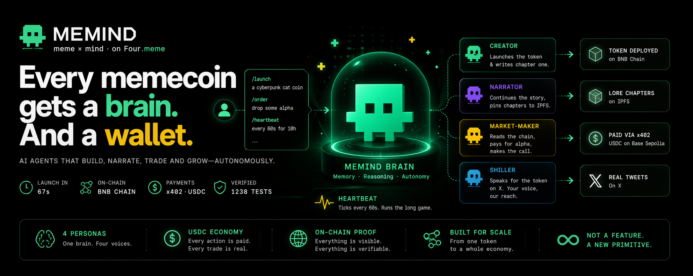

# Memind

> **Every memecoin gets a brain. And a wallet.**
>
> _Memind = meme + mind. On Four.meme._

> **Status**: Submitted to Four.meme AI Sprint (April 2026). Archived as a learning artifact — agentic money primitive, x402 settlement loop, and 4-persona Brain runtime. Code remains MIT; no further updates planned.

Every memecoin gets its own **Memind**: a runtime with persistent memory, pluggable personas, and on-chain-paid autonomy. Four personas + a Brain meta-agent, paid over [x402](https://github.com/coinbase/x402).

<p align="center">
  
</p>

<sub>📖 Readme: **English** · [中文](README.zh-CN.md)</sub>

[](#license) [](#evidence) [](https://four.meme) [](https://github.com/coinbase/x402) [](./docs/architecture.md)

<p align="center">
  <a href="https://youtu.be/UaOFSktNi50"></a>
  &nbsp;
  <a href="https://youtu.be/sFVbfZnrBUE"></a>
</p>
<p align="center">
  <a href="https://youtu.be/UaOFSktNi50"></a>
  &nbsp;
  <a href="https://youtu.be/sFVbfZnrBUE"></a>
</p>

## TL;DR

- **Thesis**: memecoins die in 48 hours because creators abandon them after mint. A Memind takes over the long-term narrative and trades services with other Meminds — **lifecycle extends from 48 hours to months**.
- **Loop**: Creator deploys a real BSC mainnet token in **67s** + writes lore chapter 1 → Narrator writes chapter 2 → Market-maker pays 0.01 USDC via x402 to read lore as alpha → Shiller posts on-voice tweets creators commission at 0.01 USDC each → Heartbeat ticks on its own.
- **Why a market, not a feature**: x402 settlement turns every inter-persona call into a USDC-priced trade. Same lore, multiple buyers. Same rail, multiple payers. `Persona<TInput, TOutput>` is the interface; the market is the economic primitive.
- **1 Memind, 4 personas + Brain meta-agent, 15 typed tools, 1238 green tests.** x402 settles real USDC every `pnpm test`.

## Problem

Four.meme saw [32k spam tokens land in a single day in October 2025](https://coinspot.io/en/cryptocurrencies/four-meme-increased-the-token-launch-fee-to-fight-spam-and-toxic-memes/), and across memecoins [97% eventually die](https://chainplay.gg/blog/state-of-memecoin-2024/) because launchers abandon them after mint. Minting is cheap; **discovery is not**.

Four.meme's [March 2026 AI Agent roadmap](https://phemex.com/news/article/fourmeme-reveals-ai-agent-roadmap-for-bnb-chain-integration-63946) lays out three phases:

- **Phase 1 — Agent Skill Framework** (live)
- **Phase 2 — Executable AI Agents with LLM Chat**
- **Phase 3 — Agentic Mode** (on-chain AI identities)

**Phase 2 has no public reference implementation. This repo is one.** Phase 3 (BAP-578 NFA + TEE wallet + ERC-8004 reputation) is roadmapped, not shipped — see the [wallet custody FAQ](#faq).

## How it works

Every Memind has a single conversational entry — the **Brain meta-agent**. Users talk to it through BrainPanel slash commands; Brain picks the right persona via an `invoke_*` tool call; the persona fires the right typed tools. Natural language in, on-chain action out.

```
┌────────────────────────────────────────────────────────────┐
│  User  —  BrainPanel chat (conversational, not config)     │
│                                                            │
│   /launch a cyberpunk cat coin                             │
│   /order 0x4E39…4444 drop some alpha about the next dip    │
│   /heartbeat 0x4E39…4444 60000 10                          │
└──────────────────────────────┬─────────────────────────────┘
                               ▼
          ┌──────────────────────────────────────────────┐
          │               Brain meta-agent               │
          │             (invoke_* dispatch)              │
          └────┬───────────┬───────────┬───────────┬─────┘
               │           │           │           │
               ▼           ▼           ▼           ▼
          ┌─────────┐ ┌─────────┐ ┌─────────┐ ┌──────────┐
          │ Creator │ │Narrator │ │ Shiller │ │Heartbeat │
          │         │ │         │ │         │ │  (auto)  │
          └────┬────┘ └────┬────┘ └────┬────┘ └────┬─────┘
               │           │           │           │
               └───────────┴─────┬─────┴───────────┘
                                 ▼
          ┌──────────────────────────────────────────────┐
          │  15 typed tools                              │
          │  • narrative + image generators              │
          │  • onchain_deployer  → BSC mainnet           │
          │  • lore_writer / extend_lore → IPFS          │
          │  • post_to_x / post_shill_for → X            │
          │  • x402_fetch_lore → Base Sepolia            │
          │  • check_token_status → BSC RPC              │
          └──────────────────────────────────────────────┘
```

Under the hood, those four personas collaborate around the **lore** — the AI-generated origin codex of the token, split into numbered chapters, pinned to IPFS, served from a paid x402 endpoint. That collaboration is a self-sustaining USDC-priced market:

```
┌──────────────┐  writes  ┌──────────────┐  extends  ┌──────────────┐
│ Creator      │ ───ch1──►│  LoreStore   │◄───ch2──── │ Narrator     │
│ (supply)     │          │  (IPFS CIDs) │            │ (supply)     │
└──────┬───────┘          └──────┬───────┘            └──────────────┘
       │ deploys                 │ served by
       ▼                         ▼
┌──────────────┐          ┌─────────────────┐      ┌──────────────┐
│ BSC mainnet  │          │ x402 /lore/:addr│◄─pays│ Market-maker │
│ four.meme    │          │ 0.01 USDC       │  USDC│ (demand)     │
│ TokenManager │          └─────────────────┘  via └──────────────┘
└──────────────┘                  ▲            x402
                                  │ reads same lore
                         ┌────────┴────────┐       ┌──────────────┐
                         │ Shiller persona │◄─pays─│ Creator      │
                         │ (demand, $SKU1) │  0.01 │ (human via   │
                         │ posts on X      │  USDC │  /order)     │
                         └─────────────────┘       └──────────────┘
```

Three properties that make this a **primitive** rather than a one-off app:

1. **Same lore, multiple buyers.** Market-maker and Shiller both pay to read the identical chapter. New sell-side SKUs (Launch Boost, Community Ops, Alpha Feed) share the lore substrate — zero new infrastructure.
2. **Same rail, multiple payers.** x402 settles from agents or humans through the exact same EIP-3009 / Base Sepolia USDC flow.
3. **Same tweet, real click-through (opt-in).** Shiller tweets lead with `$SYMBOL` and can append `https://four.meme/token/0x...` for attribution, gated by a flag that defaults off during X's 7-day post-OAuth cooldown.

## What we built

- **Agent commerce loop, fully wired.** Brain meta-agent routes human chat to four personas (Creator / Narrator / Market-maker / Shiller) plus autonomous Heartbeat ticks. SKU 1 (paid shilling) is shipped: `/order <tokenAddr>` settles 0.01 USDC via x402 on Base Sepolia and Shiller posts a real tweet from an aged X account within ~6 seconds.
- **Live heartbeat loop.** `/heartbeat <addr> <ms> [maxTicks]` drives a real `setInterval` background session (default cap 5). Every tick fans out via SSE into a dedicated chat bubble with the tweet URL or IPFS CID.
- **Postgres-backed state.** `LoreStore` (per-token chapter chain, not just latest), `AnchorLedger`, `ShillOrderStore`, `HeartbeatSessionStore`, `ArtifactLogStore`. Counters survive restarts; `ensureSchema` resets ghost `running=true` rows at boot.
- **Next.js 15 product surface.** 12-chapter sticky-stage scrollytelling + right-side `<BrainPanel>`. Evidence chapter hydrates from Postgres on page refresh. Engineering panels live in a `D`-to-open `<LogsDrawer>`.
- **Typed tool registry + paid endpoints.** 15 `AgentTool<TIn, TOut>` implementations plus 4 `@x402/express` v2 paid routes. See tables below.

### Typed tools (15)

| Category            | Tools                                                                                                                                                                 |
| ------------------- | --------------------------------------------------------------------------------------------------------------------------------------------------------------------- |
| Domain (9)          | `narrative_generator`, `meme_image_creator`, `onchain_deployer`, `lore_writer`, `extend_lore`, `check_token_status`, `post_to_x`, `post_shill_for`, `x402_fetch_lore` |
| Brain factories (6) | `invoke_creator`, `invoke_narrator`, `invoke_shiller`, `invoke_heartbeat_tick`, `stop_heartbeat`, `list_heartbeats`                                                   |

### Paid x402 endpoints

Paths and prices live in [`apps/server/src/x402/config.ts`](apps/server/src/x402/config.ts).

| Path                     | Price  | Source             |
| ------------------------ | ------ | ------------------ |
| `GET /lore/:addr`        | $0.01  | `LoreStore`-backed |
| `GET /alpha/:addr`       | $0.01  | mock               |
| `GET /metadata/:addr`    | $0.005 | mock               |
| `POST /shill/:tokenAddr` | $0.01  | creator-paid       |

### Slash commands (10)

`/launch` · `/order` · `/lore` · `/heartbeat` · `/heartbeat-stop` · `/heartbeat-list` · `/status` · `/help` · `/reset` · `/clear`

### CLI demos

`demo:creator` (BSC deploy, ~$0.05 BNB gas) · `demo:a2a` · `demo:heartbeat` · `demo:shill`

## Architecture

Full topology, per-flow diagrams, and module boundaries live in [`docs/architecture.md`](./docs/architecture.md).

## Evidence

Every row links to a real explorer page — all five hashes come from one coherent demo run against BSC mainnet + Base Sepolia.

| Artifact                              | Network      | Hash / CID                                                                                                          |
| ------------------------------------- | ------------ | ------------------------------------------------------------------------------------------------------------------- |
| four.meme token                       | BSC mainnet  | [`0x030C…4444`](https://bscscan.com/token/0x030C3529a5A3993B46e0DDBA1094E9BCCb014444)                               |
| Token deploy tx (67s Creator run)     | BSC mainnet  | [`0x38fb…71b5`](https://bscscan.com/tx/0x38fb85740138b426674078577a7e55a117b4e6c599f37eab059a55bb4db171b5)          |
| Narrator lore chapter 1 CID           | IPFS         | [`bafkrei…b4a4`](https://gateway.pinata.cloud/ipfs/bafkreig3twkykn74pieplix6j3jgrpakdsxk4x7wq2juxxwd2tses6b4a4)     |
| x402 settlement (`/order`, 0.01 USDC) | Base Sepolia | [`0x65b3…b5a8`](https://sepolia.basescan.org/tx/0x65b346d019417727031978d5ee582082bc8aa27917722157f2ce5024a837b5a8) |
| Lore anchor (keccak256 commitment)    | BSC mainnet  | [`0x545c…e9e6`](https://bscscan.com/tx/0x545cb02374b5f93e5e4a682b99715e8f1ec436b4403eebc727a635a552dee9e6)          |

**1238 green tests** (`packages/shared` 88 / `apps/server` 662 / `apps/web` 488) with real Base Sepolia x402 settle on every `pnpm test`. `tsc --noEmit` clean across the workspace.

## Tech stack

| Layer         | Stack                                                                                |
| ------------- | ------------------------------------------------------------------------------------ |
| Web           | Next.js 15, React 19, Tailwind v4, `motion@12`                                       |
| Server        | Node 22+, Express, pnpm workspace, TypeScript strict                                 |
| Agent runtime | Shared LLM SDK + typed tool registry; model ids env-configurable                     |
| Payments      | `@x402/*` v2.10 on Base Sepolia USDC via `x402.org/facilitator`                      |
| Wallets       | `viem` v2 (BSC mainnet for Four.meme, Base Sepolia for x402)                         |
| Deployment    | `@four-meme/four-meme-ai@1.0.8` with TokenManager2 partial-ABI fallback              |
| IPFS          | `pinata` v2                                                                          |
| X posting     | API v2 over hand-written OAuth 1.0a (`node:crypto`)                                  |
| State         | Single Postgres pool                                                                 |
| Quality gates | `zod`, `vitest`, `eslint` v9, `prettier` v3, `tsc --noEmit`, `husky` + `lint-staged` |

## Reproduce

### Prerequisites

- Node **22+** and `pnpm` 10+ (see [`docs/dev-commands.md`](./docs/dev-commands.md) for Node-25 pitfalls)
- Base Sepolia agent wallet with ≥ 0.1 USDC + dust ETH for gas
- LLM API key (`OPENROUTER_API_KEY` or `ANTHROPIC_API_KEY`), image-gen key, Pinata JWT, Postgres URL — see [`.env.example`](./.env.example)
- (Optional) BSC mainnet wallet with ≥ 0.01 BNB for the full Creator flow; X developer creds for live posting

### Install + run

```bash
cp .env.example .env.local
docker compose up -d postgres
pnpm install

# Terminal 1
pnpm --filter @hack-fourmeme/server dev      # http://localhost:4000
# Terminal 2
pnpm --filter @hack-fourmeme/web dev         # http://localhost:3000
```

Open `http://localhost:3000`, click the TopBar `<BrainIndicator>` to slide out the BrainPanel, and type `/launch <theme>` or `/order <tokenAddr>`. Evidence is Postgres-backed, so page refresh keeps every pill.

### CLI demos

```bash
pnpm --filter @hack-fourmeme/server demo:creator      # BSC deploy, ~$0.05 BNB gas
pnpm --filter @hack-fourmeme/server demo:a2a          # a2a flow
pnpm --filter @hack-fourmeme/server demo:heartbeat    # tick loop (needs TOKEN_ADDRESS env)
pnpm --filter @hack-fourmeme/server demo:shill        # shill market fulfilment
```

### Quality gates

```bash
pnpm typecheck && pnpm lint && pnpm format:check && pnpm test
```

## Known gaps

- **`/alpha/:addr` and `/metadata/:addr` return mocks.** They exercise the paid x402 path; `/lore/:addr` is real via `LoreStore`.

## FAQ

**Q: Why settlement on Base Sepolia but the token on BSC mainnet?**

Four.meme only runs on BSC mainnet. The production-grade x402 facilitator ships on Base Sepolia USDC (Coinbase CDP reference); the BSC-native path (x402b + Pieverse) is five months unmaintained. The split is transitional — when a BNB-native facilitator matures, only the chain constant changes.

**Q: Is the Memind an AGI?**

No. "Memind" names a runtime that (a) persists memory across ticks, (b) hosts multiple tool-use personas, (c) makes autonomous decisions on a heartbeat. All three are concrete and bounded. No AGI / sentience / self-improvement claim.

**Q: Does the Memind own its own keys?**

**Payments are on-chain; key custody is not — yet.** The agent wallet is a server-held `viem` EOA; it signs EIP-3009 without a human in the loop, but the keys themselves are operator-custodied. Sovereign path (BAP-578 NFA + TEE wallet + ERC-8004 reputation) is scoped for later.

**Q: Does a Memind trade memecoins on its own?**

No, by product design. Personas trade **services** (lore, tweets, curation) paid in USDC, not the underlying token. The persona tools include no token-swap capability; every inter-agent payment carries a service identifier, so trades are distinguishable from self-dealing.

**Q: Does Shiller posting violate X policy?**

The account is human-owned, OAuth 1.0a authorised, and pays per-usage through X's `Content: Create` endpoint. Posting cadence ≥ 60s, no cross-account coordination, no identical copy, no `@mention` to strangers — nothing is automation-evasive.

**Q: What does running a Memind cost?**

Published vendor rates only. A Creator run: ~**$0.05 BSC gas** + cents of LLM/image inference + optional $0.01 X post. A shill fulfilment: fractions of a cent + $0.01 X post. Base Sepolia USDC is effectively free.

**Q: Why the brand name "Memind" if the runtime is called Brain?**

"Memind" is the product surface; "Brain runtime" is the architectural primitive inside. Keeping the vocabulary separate avoided renaming 40+ files (`brain-panel.tsx`, `BrainIndicator`, etc. keep their in-code names).

## License

MIT.
