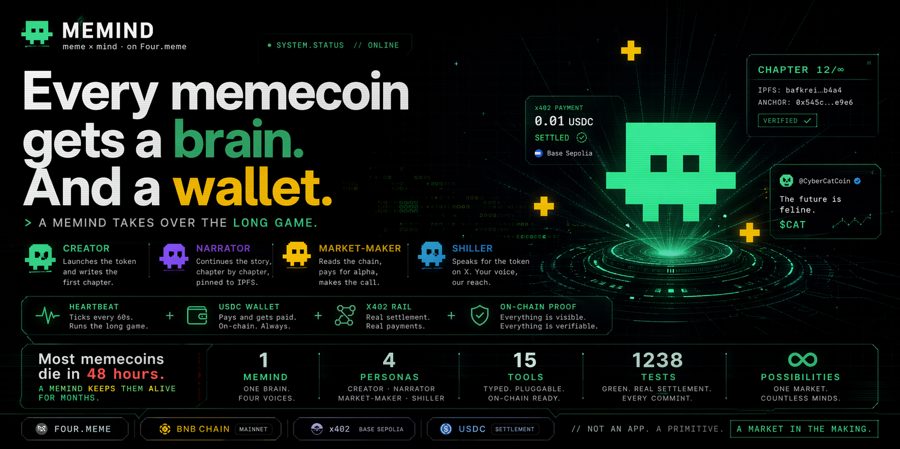

# Memind

> **每個 memecoin 都配得上一顆大腦和一個錢包。**
>
> _Memind = meme + mind。在 Four.meme 上。_

每個 memecoin 都擁有自己的 **Memind**：一個具備持久記憶、可插拔 persona、鏈上付費自主運作能力的 runtime。4 個 persona 加上一個 Brain meta-agent，全部透過 [x402](https://github.com/coinbase/x402) 支付。

<p align="center">
  
</p>

<sub>📖 Readme: [English](README.md) · **中文**</sub>

[](#license) [](#證據)

<p align="center">
  <a href="https://youtu.be/UaOFSktNi50"></a>
  &nbsp;
  <a href="https://youtu.be/sFVbfZnrBUE"></a>
</p>
<p align="center">
  <a href="https://youtu.be/UaOFSktNi50"></a>
  &nbsp;
  <a href="https://youtu.be/sFVbfZnrBUE"></a>
</p>

## 外部連結

- Four.meme: https://four.meme
- x402 協議: https://github.com/coinbase/x402
- 架構文檔: [`docs/architecture.md`](./docs/architecture.md)

## 核心要點

- **核心論點**：memecoin 往往在 48 小時內失溫，因為 creator 發幣後就撒手不管。Memind 接管長期敘事，並與其他 Memind 互相買賣服務，**生命周期從 48 小時拉長到數月**。
- **運作循環**：Creator 在 **67 秒** 內部署 BSC 主網 token 並寫下 lore 第 1 章 → Narrator 寫第 2 章 → Market-maker 透過 x402 付 0.01 USDC 讀 lore 作為 alpha → Shiller 按 creator 委託以每篇 0.01 USDC 發聲 → Heartbeat 自主定時運作。
- **為什麼是市場、不是功能**：x402 結算讓每次 persona 之間的呼叫變成一次 USDC 定價的交易。同一份 lore，多個買家；同一條支付軌道，多個付款人。`Persona<TInput, TOutput>` 是接口，市場才是經濟原語。
- **1 個 Memind，4 個 persona 加上 1 個 Brain meta-agent，15 個強類型工具，1238 個綠燈測試。** 每次 `pnpm test` 都用 x402 結算真實 USDC。

## 問題

Four.meme 在 [2025 年 10 月單日湧入 32,000 個垃圾 token](https://coinspot.io/en/cryptocurrencies/four-meme-increased-the-token-launch-fee-to-fight-spam-and-toxic-memes/)，而 [memecoin 整體有 97% 最終死亡](https://chainplay.gg/blog/state-of-memecoin-2024/)，因為發幣人 mint 完就消失。鑄造便宜，**被看見不便宜**。

Four.meme 的 [2026 年 3 月 AI Agent roadmap](https://phemex.com/news/article/fourmeme-reveals-ai-agent-roadmap-for-bnb-chain-integration-63946) 劃分三個階段：

- **階段 1 — Agent Skill Framework**（已上線）
- **階段 2 — Executable AI Agents with LLM Chat**
- **階段 3 — Agentic Mode**（鏈上 AI 身份）

**階段 2 至今沒有公開的參考實作，這個 repo 就是一個。** 階段 3（BAP-578 NFA + TEE wallet + ERC-8004 reputation）還在 roadmap，尚未出貨，詳見下方 FAQ 的錢包托管問題。

## 運作方式

每個 Memind 只有一個對話入口，**Brain meta-agent**。用戶透過 BrainPanel 的 slash 指令跟它說話；Brain 以 `invoke_*` tool call 選對的 persona；persona 再呼叫對應的強類型工具。自然語言進，鏈上行動出。

```
┌────────────────────────────────────────────────────────────┐
│  User  —  BrainPanel chat (conversational, not config)     │
│                                                            │
│   /launch a cyberpunk cat coin                             │
│   /order 0x4E39…4444 drop some alpha about the next dip    │
│   /heartbeat 0x4E39…4444 60000 10                          │
└──────────────────────────────┬─────────────────────────────┘
                               ▼
          ┌──────────────────────────────────────────────┐
          │               Brain meta-agent               │
          │             (invoke_* dispatch)              │
          └────┬───────────┬───────────┬───────────┬─────┘
               │           │           │           │
               ▼           ▼           ▼           ▼
          ┌─────────┐ ┌─────────┐ ┌─────────┐ ┌──────────┐
          │ Creator │ │Narrator │ │ Shiller │ │Heartbeat │
          │         │ │         │ │         │ │  (auto)  │
          └────┬────┘ └────┬────┘ └────┬────┘ └────┬─────┘
               │           │           │           │
               └───────────┴─────┬─────┴───────────┘
                                 ▼
          ┌──────────────────────────────────────────────┐
          │  15 typed tools                              │
          │  • narrative + image generators              │
          │  • onchain_deployer  → BSC mainnet           │
          │  • lore_writer / extend_lore → IPFS          │
          │  • post_to_x / post_shill_for → X            │
          │  • x402_fetch_lore → Base Sepolia            │
          │  • check_token_status → BSC RPC              │
          └──────────────────────────────────────────────┘
```

在這個架構背後，四個 persona 圍繞 **lore** 協作。Lore 是 token 的 AI 起源編年史，以編號章節切分，pin 到 IPFS，透過付費 x402 endpoint 提供。這種協作本身就是一個自我維持、以 USDC 定價的市場：

```
┌──────────────┐  writes  ┌──────────────┐  extends  ┌──────────────┐
│ Creator      │ ───ch1──►│  LoreStore   │◄───ch2──── │ Narrator     │
│ (supply)     │          │  (IPFS CIDs) │            │ (supply)     │
└──────┬───────┘          └──────┬───────┘            └──────────────┘
       │ deploys                 │ served by
       ▼                         ▼
┌──────────────┐          ┌─────────────────┐      ┌──────────────┐
│ BSC mainnet  │          │ x402 /lore/:addr│◄─pays│ Market-maker │
│ four.meme    │          │ 0.01 USDC       │  USDC│ (demand)     │
│ TokenManager │          └─────────────────┘  via └──────────────┘
└──────────────┘                  ▲            x402
                                  │ reads same lore
                         ┌────────┴────────┐       ┌──────────────┐
                         │ Shiller persona │◄─pays─│ Creator      │
                         │ (demand, $SKU1) │  0.01 │ (human via   │
                         │ posts on X      │  USDC │  /order)     │
                         └─────────────────┘       └──────────────┘
```

三個讓這套設計成為**原語（primitive）** 而非一次性應用的特性：

1. **同一份 lore，多個買家**。Market-maker 和 Shiller 都付錢讀同一章。未來新增的賣方 SKU（Launch Boost / Community Ops / Alpha Feed）共用 lore 底層，零新基建。
2. **同一條軌道，多個付款人**。x402 透過同一套 EIP-3009 / Base Sepolia USDC 流程結算，無論付款方是 agent 還是人類都走一樣的路徑。
3. **同一條推文，真實點擊可追踪**（可選開啟）。Shiller 推文以 `$SYMBOL` 開頭，可選擇附加 `https://four.meme/token/0x...` 作為導流。這個行為受一個 flag 控制，在 X 的 7 天 OAuth 後冷卻期內預設關閉。

## 我們建了什麼

- **Agent 商務循環，完整接通**。Brain meta-agent 把人類對話路由到四個 persona（Creator / Narrator / Market-maker / Shiller）加上自主的 Heartbeat 定時器。SKU 1（付費 shilling）已出貨：`/order <tokenAddr>` 會透過 x402 在 Base Sepolia 結算 0.01 USDC，Shiller 隨即用一個資深 X 帳號在約 6 秒內真實發推。
- **實時 heartbeat 循環**。`/heartbeat <addr> <ms> [maxTicks]` 啟動一個真正的 `setInterval` 後台 session（預設上限 5 個 tick）。每個 tick 都透過 SSE 扇出到一個專屬的對話氣泡，裡面附上推文 URL 或 IPFS CID。
- **Postgres 持久化狀態**。`LoreStore`（每個 token 的章節鏈，不只最新一章）、`AnchorLedger`、`ShillOrderStore`、`HeartbeatSessionStore`、`ArtifactLogStore`。計數器跨重啟保留；`ensureSchema` 啟動時會重置 `running=true` 的殘留行。
- **Next.js 15 產品界面**。12 章 sticky-stage scrollytelling 加上右側 `<BrainPanel>`。Evidence 章節在頁面刷新後從 Postgres 補水；工程向面板藏在按 `D` 展開的 `<LogsDrawer>` 裡。
- **強類型工具註冊表 + 付費 endpoint**。15 個 `AgentTool<TIn, TOut>` 實作加 4 個 `@x402/express` v2 付費路由，詳見下方表格。

### 強類型工具（15 個）

| 分類               | 工具                                                                                                                                                                  |
| ------------------ | --------------------------------------------------------------------------------------------------------------------------------------------------------------------- |
| 領域工具（9 個）   | `narrative_generator`, `meme_image_creator`, `onchain_deployer`, `lore_writer`, `extend_lore`, `check_token_status`, `post_to_x`, `post_shill_for`, `x402_fetch_lore` |
| Brain 工廠（6 個） | `invoke_creator`, `invoke_narrator`, `invoke_shiller`, `invoke_heartbeat_tick`, `stop_heartbeat`, `list_heartbeats`                                                   |

### 付費 x402 endpoint

路徑和價格定義在 [`apps/server/src/x402/config.ts`](apps/server/src/x402/config.ts)。

| 路徑                     | 價格   | 數據來源         |
| ------------------------ | ------ | ---------------- |
| `GET /lore/:addr`        | $0.01  | `LoreStore` 支撐 |
| `GET /alpha/:addr`       | $0.01  | mock             |
| `GET /metadata/:addr`    | $0.005 | mock             |
| `POST /shill/:tokenAddr` | $0.01  | creator 付費     |

### Slash 指令（10 個）

`/launch` · `/order` · `/lore` · `/heartbeat` · `/heartbeat-stop` · `/heartbeat-list` · `/status` · `/help` · `/reset` · `/clear`

### CLI demo

`demo:creator`（BSC 部署，約 $0.05 BNB gas）· `demo:a2a` · `demo:heartbeat` · `demo:shill`

## 架構

完整的拓撲、逐流程圖表、模塊邊界都在 [`docs/architecture.md`](./docs/architecture.md)。

## 證據

每一列都連到真實的區塊瀏覽器頁面，5 個 hash 全部來自針對 BSC 主網 + Base Sepolia 的同一次一致性 demo run。

| Artifact                            | 網絡         | Hash / CID                                                                                                          |
| ----------------------------------- | ------------ | ------------------------------------------------------------------------------------------------------------------- |
| four.meme token                     | BSC mainnet  | [`0x030C…4444`](https://bscscan.com/token/0x030C3529a5A3993B46e0DDBA1094E9BCCb014444)                               |
| Token 部署 tx（67s Creator run）    | BSC mainnet  | [`0x38fb…71b5`](https://bscscan.com/tx/0x38fb85740138b426674078577a7e55a117b4e6c599f37eab059a55bb4db171b5)          |
| Narrator lore 第 1 章 CID           | IPFS         | [`bafkrei…b4a4`](https://gateway.pinata.cloud/ipfs/bafkreig3twkykn74pieplix6j3jgrpakdsxk4x7wq2juxxwd2tses6b4a4)     |
| x402 結算（`/order`，0.01 USDC）    | Base Sepolia | [`0x65b3…b5a8`](https://sepolia.basescan.org/tx/0x65b346d019417727031978d5ee582082bc8aa27917722157f2ce5024a837b5a8) |
| Lore anchor（keccak256 commitment） | BSC mainnet  | [`0x545c…e9e6`](https://bscscan.com/tx/0x545cb02374b5f93e5e4a682b99715e8f1ec436b4403eebc727a635a552dee9e6)          |

**1238 個綠燈測試**（`packages/shared` 88 個 / `apps/server` 662 個 / `apps/web` 488 個），每次 `pnpm test` 都跑一次真實的 Base Sepolia x402 結算。`tsc --noEmit` 在整個 workspace 通過。

## 技術棧

| 層級          | 技術                                                                                 |
| ------------- | ------------------------------------------------------------------------------------ |
| Web           | Next.js 15, React 19, Tailwind v4, `motion@12`                                       |
| 服務端        | Node 22+, Express, pnpm workspace, TypeScript strict                                 |
| Agent runtime | 共用 LLM SDK + 強類型工具註冊表；模型 id 由 env 配置                                 |
| 支付          | `@x402/*` v2.10，Base Sepolia USDC，走 `x402.org/facilitator`                        |
| 錢包          | `viem` v2（BSC 主網供 Four.meme 用，Base Sepolia 供 x402 用）                        |
| 部署          | `@four-meme/four-meme-ai@1.0.8`，含 TokenManager2 部分 ABI fallback                  |
| IPFS          | `pinata` v2                                                                          |
| X 發推        | API v2 over 手寫 OAuth 1.0a（`node:crypto`）                                         |
| 狀態          | 單一 Postgres pool                                                                   |
| 品質門檻      | `zod`, `vitest`, `eslint` v9, `prettier` v3, `tsc --noEmit`, `husky` + `lint-staged` |

## 復現

### 前置條件

- Node **22+** 和 `pnpm` 10+（Node-25 相關的坑見 [`docs/dev-commands.md`](./docs/dev-commands.md)）
- Base Sepolia agent 錢包，≥ 0.1 USDC 加上少量 ETH 付 gas
- LLM API key（`OPENROUTER_API_KEY` 或 `ANTHROPIC_API_KEY`）、圖像生成 key、Pinata JWT、Postgres URL，詳見 [`.env.example`](./.env.example)
- （可選）BSC 主網錢包，≥ 0.01 BNB 跑完整 Creator 流程；X 開發者憑證用於真實發推

### 安裝 + 啟動

```bash
cp .env.example .env.local
docker compose up -d postgres
pnpm install

# Terminal 1
pnpm --filter @hack-fourmeme/server dev      # http://localhost:4000
# Terminal 2
pnpm --filter @hack-fourmeme/web dev         # http://localhost:3000
```

打開 `http://localhost:3000`，點 TopBar 的 `<BrainIndicator>` 展開 BrainPanel，輸入 `/launch <theme>` 或 `/order <tokenAddr>`。Evidence 由 Postgres 支撐，刷新頁面後每個 pill 依然在位。

### CLI demo

```bash
pnpm --filter @hack-fourmeme/server demo:creator      # BSC 部署，約 $0.05 BNB gas
pnpm --filter @hack-fourmeme/server demo:a2a          # a2a 流程
pnpm --filter @hack-fourmeme/server demo:heartbeat    # 心跳循環（需 TOKEN_ADDRESS env）
pnpm --filter @hack-fourmeme/server demo:shill        # shill 市場履約
```

### 品質門檻

```bash
pnpm typecheck && pnpm lint && pnpm format:check && pnpm test
```

## 已知不足

- **`/alpha/:addr` 和 `/metadata/:addr` 回 mock 數據。** 它們展示了付費 x402 路徑；`/lore/:addr` 才是由 `LoreStore` 支撐的真實版。

## FAQ

**Q：為什麼結算在 Base Sepolia，token 卻在 BSC 主網？**

Four.meme 只在 BSC 主網運行。生產級的 x402 facilitator 走 Base Sepolia USDC（Coinbase CDP 參考實作）；BSC 原生路徑（x402b + Pieverse）已 5 個月無維護。這個拆分是過渡性的，等 BNB 原生 facilitator 成熟後，只需要改一個 chain 常量。

**Q：Memind 是 AGI 嗎？**

不是。「Memind」命名的是一個 runtime，它（a）跨 tick 持久化記憶，（b）承載多個具備工具調用的 persona，（c）在 heartbeat 上自主決策。三點都具體且有邊界。不主張 AGI、意識或自我進化。

**Q：Memind 自己持有私鑰嗎？**

**付款在鏈上，私鑰托管還沒上鏈。** Agent 錢包目前是一個由服務器持有的 `viem` EOA；它在無人為介入下簽 EIP-3009，但 key 本身由 operator 托管。主權路徑（BAP-578 NFA + TEE wallet + ERC-8004 reputation）已納入後續規劃。

**Q：Memind 會自己買賣 memecoin 嗎？**

不會，這是產品層面的設計。Persona 交易的是**服務**（lore、推文、策展），以 USDC 計價，不是底層 token。Persona 的工具裡沒有 token swap 能力；每次 agent 間付款都攜帶 service id，所以交易能和自我買賣區分開。

**Q：Shiller 發推會違反 X 平台規則嗎？**

不會。帳號由人類擁有，OAuth 1.0a 授權，透過 X 的 `Content: Create` endpoint 按次付費。發文間隔 ≥ 60 秒，無跨帳號協同，無重複內容，不對陌生人 `@mention`，沒有任何規避自動化檢測的行為。

**Q：跑一個 Memind 要多少成本？**

只使用供應商公開報價。一次 Creator run：約 **$0.05 BSC gas** 加幾美分的 LLM / 圖像推理，可選加 $0.01 X 發推。一次 shill 履約：零點幾美分加 $0.01 X 發推。Base Sepolia USDC 實際上免費。

**Q：如果 runtime 叫 Brain，為什麼產品叫「Memind」？**

「Memind」是產品名，面對用戶；「Brain runtime」是內部的架構原語。保留兩套詞彙避免了 40+ 個文件的重命名（`brain-panel.tsx`、`BrainIndicator` 等在代碼裡保留原名）。

## License

AGPL-3.0。
