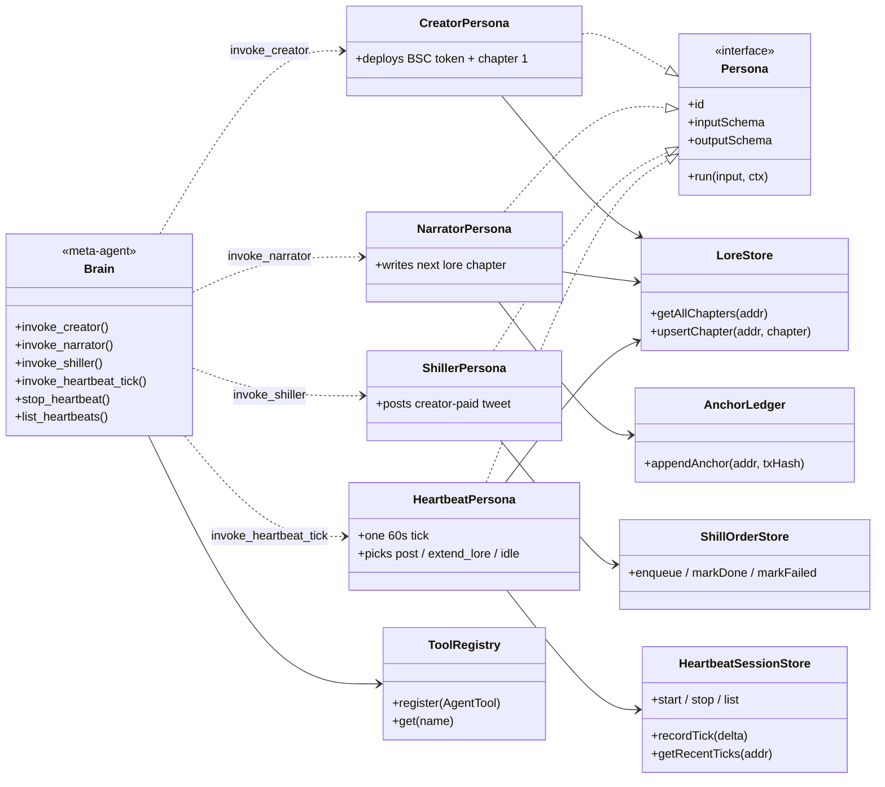
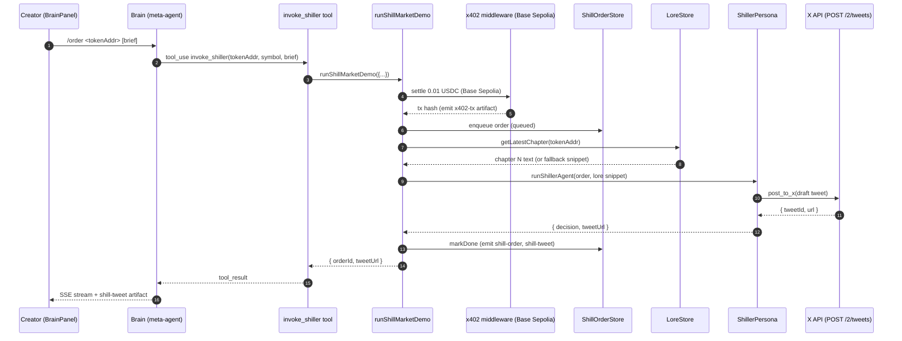

# Architecture

## Memind / Brain-Persona Model

One **Memind** per memecoin. Each Memind is internally a **Brain runtime** hosting **four pluggable personas** (Creator / Narrator / Market-maker / Heartbeat). Market-maker is dual-mode: reads lore as alpha in a2a, or switches to **Shiller** mode for creator-commissioned tweets.

This is a naming layer over a shipped runtime — every claim below anchors to code:

| Memind claim                  | Implementation fact                                                                                                                                                                            | File                                                                           |
| ----------------------------- | ---------------------------------------------------------------------------------------------------------------------------------------------------------------------------------------------- | ------------------------------------------------------------------------------ |
| One Memind per Node process   | Single LLM client, single `ToolRegistry`, single event-emitter fan-out                                                                                                                         | `apps/server/src/index.ts`, `apps/server/src/agents/runtime.ts`                |
| Shared memory across personas | `LoreStore` + `AnchorLedger` + `ShillOrderStore` + `HeartbeatSessionStore` + `ArtifactLogStore` all persist through the same Postgres pool (pg-backed; Railway plugin, `ensureSchema` at boot) | `apps/server/src/state/*.ts`, `apps/server/src/db/*.ts`                        |
| Each persona is pluggable     | Every persona is a thin `runAgentLoop` wrapper (`systemPrompt` + selected tool subset) — no persona-specific runtime                                                                           | `apps/server/src/agents/{creator,narrator,market-maker,heartbeat,brain}.ts`    |
| Explicit pluggable contract   | `Persona<TInput, TOutput>` interface in shared package + `persona-adapters.ts` wrappers (creator / narrator / shiller / heartbeat)                                                             | `packages/shared/src/persona.ts`, `apps/server/src/agents/persona-adapters.ts` |
| Autonomous tick               | Heartbeat persona drives a `setInterval` loop that picks the next action (post / extend_lore / idle) every tick                                                                                | `apps/server/src/agents/heartbeat.ts`                                          |
| Meta-agent orchestration      | **Brain** persona wraps four `invoke_*` tool factories (creator / narrator / shiller / heartbeat_tick); routes slash-driven chat turns to personas                                             | `apps/server/src/agents/brain.ts`, `apps/server/src/tools/invoke-persona.ts`   |

**Why the code directory still says `agents/`**: renaming buys zero runtime behaviour and churns 40+ files. Pitch surface uses Memind / persona vocabulary; code keeps `agent` for continuity. Mapping: _Memind = product brand; Brain = runtime substrate; persona = pluggable SKU_.

**Adding a new SKU = adding a new persona**: ~50 lines — a new `systemPrompt`, a subset of existing tools (at most one new `AgentTool`), an adapter in `persona-adapters.ts` that satisfies `Persona<TInput, TOutput>`, and one `invoke_<persona>` factory in `tools/invoke-persona.ts`. No new x402 infrastructure, no new memory layer. The pluggability is the product.

### Class diagram — Brain, personas, shared stores

Brain owns the four `invoke_*` tools; each delegates to one persona adapter that satisfies the shared `Persona<TInput, TOutput>` interface. Personas pull from the shared Postgres-backed stores.



## Top-Level Shape

pnpm workspace monorepo with three packages:

```
hack-bnb-fourmeme-agent-creator/
├── apps/
│   ├── web/              # Next.js 15 App Router — Memind scrollytelling surface
│   │   └── src/
│   │       ├── app/
│   │       │   ├── layout.tsx        # Inter + JetBrains Mono fonts, RunStateProvider
│   │       │   ├── page.tsx          # StickyStage shell + 12-chapter cross-fade
│   │       │   ├── market/page.tsx   # 307 redirect → /#order-shill (legacy URL kept)
│   │       │   └── demo/glyph/       # Internal QA surface for pixel-human moods
│   │       ├── components/
│   │       │   ├── chapters/         # Ch1-Ch12 real components (hero / problem /
│   │       │   │                     # solution / brain / launch / shill / saga /
│   │       │   │                     # heartbeat / take-rate / sku / phase / evidence)
│   │       │   ├── brain-panel.tsx   # Right-side slide-in conversational surface
│   │       │   ├── brain-chat*.tsx   # Chat UI, slash palette, message grouping
│   │       │   ├── brain-indicator.tsx  # TopBar IDLE/ONLINE/ERROR + persona label
│   │       │   ├── header.tsx        # Fixed TopBar: progress counter + BrainIndicator
│   │       │   ├── section-toc.tsx   # Fixed left chapter index
│   │       │   ├── sticky-stage.tsx  # Cross-fade engine (opacity/scale/blur)
│   │       │   ├── logs-drawer.tsx   # Left-side dev-tools drawer, 3 tabs
│   │       │   ├── footer-drawer-tabs/  # logs-tab / artifacts-tab / console-tab
│   │       │   ├── pixel-human-glyph/   # 14-mood pixel-art avatar
│   │       │   ├── scanlines-overlay.tsx + watermark.tsx + tweaks-panel.tsx
│   │       ├── hooks/    # useRun / useRunStateContext / useBrainChat /
│   │       │             # useActiveChapter / useScrollY / useReducedMotion /
│   │       │             # useSlashPalette / useTweakMode
│   │       └── lib/      # chapters.ts (CHAPTER_META / SLOT_VH /
│   │                     #   chapterScrollTarget / resolveChapterIndexFromHash)
│   │                     # + slash-commands.ts (10-command registry: server
│   │                     #   /launch /order /lore /heartbeat /heartbeat-stop
│   │                     #   /heartbeat-list + client /status /help /reset
│   │                     #   /clear)
│   │                     # + artifact-view.ts (Artifact → pill display)
│   └── server/           # Express + x402 server + agent runtime
│       └── src/
│           ├── index.ts      # Mounts /health, x402 paid routes, /api/runs/*
│           ├── agents/       # brain / creator / narrator / market-maker / heartbeat
│           │                 # + runtime.ts (runAgentLoop) + _stream-map.ts
│           │                 # + persona-adapters.ts + _json.ts
│           ├── tools/        # registry / narrative / image / deployer / lore /
│           │                 # lore-extend / token-status / x-post / post-shill-for /
│           │                 # x-fetch-lore / invoke-persona (6 factories:
│           │                 # 4 persona dispatchers + stop_heartbeat +
│           │                 # list_heartbeats)
│           ├── state/        # LoreStore + AnchorLedger + ShillOrderStore +
│           │                 # HeartbeatSessionStore + ArtifactLogStore
│           │                 # (pg-backed; see db/ for pool + ensureSchema)
│           ├── db/            # pg.Pool singleton, CREATE TABLE IF NOT EXISTS
│           │                 # schema bootstrap, resetDb() test helper
│           ├── chain/        # viem client, TokenManager2 partial ABI, anchor-tx
│           ├── x402/         # paymentMiddleware + 4 paid routes (shipped
│           │                 # handlers: /lore, /alpha, /metadata, /shill)
│           ├── runs/         # store (RunStore) + a2a + brain-chat + creator-phase +
│           │                 # heartbeat-runner + shill-market + routes
│           ├── routes/       # health.ts (GET /health)
│           └── demos/        # demo:creator / demo:a2a / demo:heartbeat / demo:shill
├── packages/
│   └── shared/           # zod schemas + types + Persona interface
│                         # (agentId / runKind / artifact union / SSE payloads)
└── scripts/              # hello-world probes and fallback test scripts
```

## Runtime Topology

```
┌───────────────────┐    HTTP    ┌────────────────────────────────────────┐
│ Browser           │◄──────────►│ Next.js web (port 3000)                 │
│ Memind            │            │ - StickyStage 12-chapter cross-fade     │
│ scrollytelling +  │            │ - Header BrainIndicator (IDLE/ONLINE)   │
│ BrainPanel chat   │            │ - BrainPanel: POST /api/runs            │
│                   │            │     {kind:'brain-chat', messages:[…]}   │
│                   │            │   + EventSource /api/runs/:id/events    │
│                   │            │ - Ch5 / Ch6 are scripted-playback       │
│                   │            │   narrative chapters (no POST).         │
│                   │            │   Ch12 dispatches memind:open-brain     │
│                   │            │   CustomEvent to open BrainPanel.       │
│                   │            │ - LogsDrawer mirrors SSE via            │
│                   │            │   useRunStateContext                    │
│                   │            │ - same-origin rewrites → :4000          │
└───────────────────┘            └──────────────┬─────────────────────────┘
                                                │ REST / SSE
                                                ▼
                 ┌──────────────────────────────────────────────────┐
                 │ server (port 4000)                               │
                 │                                                  │
                 │ ┌──────────────────────────────────────────────┐ │
                 │ │ Agent Runtime (runAgentLoop + ToolRegistry)  │ │
                 │ │  messages.stream → _stream-map → tool_use:   │ │
                 │ │  start / tool_use:end / assistant:delta      │ │
                 │ │                                              │ │
                 │ │ ┌─────┐ ┌─────┐ ┌──────┐ ┌────────┐ ┌──────┐ │ │
                 │ │ │Crea-│ │Narr-│ │Market│ │Heartbeat│ │Brain │ │ │
                 │ │ │tor  │ │ator │ │-maker│ │(tick)  │ │(meta)│ │ │
                 │ │ │     │ │     │ │/shill│ │        │ │      │ │ │
                 │ │ └──┬──┘ └──┬──┘ └───┬──┘ └───┬────┘ └──┬───┘ │ │
                 │ └────┼───────┼────────┼────────┼─────────┼─────┘ │
                 │      │       │        │        │         │       │
                 │ ┌────▼───────▼────────▼────────▼─────────▼─────┐ │
                 │ │ Tool Registry                                │ │
                 │ │ - narrative_generator   (LLM)                │ │
                 │ │ - meme_image_creator    (image model)        │ │
                 │ │ - onchain_deployer      (four-meme-ai CLI)   │ │
                 │ │ - lore_writer           (LLM + Pinata)       │ │
                 │ │ - extend_lore           (LLM + Pinata)       │ │
                 │ │ - check_token_status    (viem / BSC RPC)     │ │
                 │ │ - post_to_x             (OAuth 1.0a + fetch) │ │
                 │ │ - post_shill_for        (paid-shill tweet)   │ │
                 │ │ - x402_fetch_lore       (wrapFetchWithPayment)│ │
                 │ │ - invoke_{creator,narrator,shiller,          │ │
                 │ │   heartbeat_tick}       (Brain meta-agent)   │ │
                 │ └──────────────────────────────────────────────┘ │
                 │                                                  │
                 │ ┌─────────────────────┐ ┌──────────────────────┐ │
                 │ │ LoreStore           │◄┤ Narrator.upsert      │ │
                 │ │ AnchorLedger        │◄┤ narrator AnchorLedger│ │
                 │ │                     │ │   append (keccak256) │ │
                 │ │ ShillOrderStore     │◄┤ x402 /shill/ enqueue │ │
                 │ │ HeartbeatSessionStore├►│ setInterval session  │ │
                 │ │ ArtifactLogStore    │►┤ /api/artifacts hydr. │ │
                 │ │ (all pg-backed;     │ │ handleLore(store hit)│ │
                 │ │  STATE_BACKEND=     │ │                      │ │
                 │ │  memory for tests)  │ │                      │ │
                 │ └─────────────────────┘ └──────────────────────┘ │
                 │                                                  │
                 │ ┌──────────────────────────────────────────────┐ │
                 │ │ x402 Server (express) — 4 paid endpoints     │ │
                 │ │ GET  /lore/:addr       ($0.01, store-backed) │ │
                 │ │ GET  /alpha/:addr      ($0.01, mock payload) │ │
                 │ │ GET  /metadata/:addr   ($0.005, mock)        │ │
                 │ │ POST /shill/:tokenAddr ($0.01, creator-paid; │ │
                 │ │   enqueues ShillOrderStore)                  │ │
                 │ │ Prices + paths live in x402/config.ts        │ │
                 │ └──────────────────────────────────────────────┘ │
                 │ ┌──────────────────────────────────────────────┐ │
                 │ │ Runs API (/api/runs)                         │ │
                 │ │ POST  /api/runs                              │ │
                 │ │   kind ∈ creator | a2a | heartbeat |         │ │
                 │ │          shill-market | brain-chat           │ │
                 │ │ GET   /api/runs/:id                          │ │
                 │ │ GET   /api/runs/:id/events  (SSE)            │ │
                 │ │ in-memory RunStore + per-run EventEmitter    │ │
                 │ └──────────────────────────────────────────────┘ │
                 │ ┌──────────────────────────────────────────────┐ │
                 │ │ /health → { status:'ok', ts:<ISO8601> }      │ │
                 │ └──────────────────────────────────────────────┘ │
                 └───────┬───────────┬──────────────┬───────────────┘
                         │           │              │
     BSC mainnet (four.meme)  │     │X API v2      │Base Sepolia (USDC)
         TokenManager2        │     │POST /2/tweets │x402 facilitator
      ◄────────────────────── ┘     │OAuth 1.0a     │@x402/* v2.10
                                    ▼               ▼
                                  api.x.com     Pinata IPFS
```

## Main Data Flow

### Flow 1 — Creator Agent autonomous token launch

```
User input (one-line theme, typed into BrainPanel as `/launch <theme>`;
            CLI alternative: pnpm demo:creator)
  → Creator.plan()                               [LLM]
  → Creator.tool[narrative_generator]            [LLM]
  → Creator.tool[meme_image_creator]             [image model]
  → Creator.tool[onchain_deployer]               [shell-exec four-meme-ai → BSC mainnet]
  → Creator.tool[lore_writer]                    [LLM → Pinata]
  → LoreStore.upsert({ tokenAddr, chapterNumber: 1, chapterText, ipfsHash,
                        tokenName, tokenSymbol, … })  [Brain-driven invoke_creator only]
  → emit artifacts: bsc-token, token-deploy-tx, meme-image, lore-cid
  → return { tokenAddr, ipfsHash, loreUri }
```

LoreStore is a per-token chapter chain (chronological, chapter 1 first). Each
entry carries `{tokenName, tokenSymbol}` so the Narrator's previous-chapter
resolver can recover both metadata and history from a single source of truth
on later `/lore` calls — no parallel tokenMeta cache.

### Flow 2 — Narrator publishes → LoreStore → x402 /lore serves paid reads

```
Narrator Agent triggered by demo / heartbeat / a2a / brain-chat
  → runAgentLoop + extend_lore tool
  → LLM generates the next chapter (context-defensive cap: 5 chapters / 12k chars)
  → Pinata upload → ipfsHash
  → LoreStore.upsert({ tokenAddr, chapterNumber, chapterText, ipfsHash, … })
  → AnchorLedger.append({ tokenAddr, chapterNumber, loreCid,
                           contentHash = keccak256(`${addr}:${ch}:${cid}`) })
  → emit artifacts: lore-cid (author:'narrator'), lore-anchor (layer-1)
  → /lore/:addr now serves the latest chapter from the store; when the store
    is empty the handler returns a mock payload so the x402 contract stays
    non-empty for the paid demo.
```

### Flow 3 — Agent-to-agent x402 payment

```
Market-maker Agent (triggered by pnpm demo:a2a CLI only — Ch5 / Ch6 are
                     scripted-playback narrative chapters, not interactive
                     panels; brain-chat /order exercises a different flow,
                     see Flow 5)
  → check_token_status reads BSC state (bonding curve / holder / marketcap)
  → soft policy decides buy-lore or skip (threshold violation still emits warn LogEvent)
  → x402_fetch_lore GET http://localhost:4000/lore/<tokenAddr>
     → wrapFetchWithPayment handles the 402 automatically
     → ExactEvmScheme signs EIP-3009, pays 0.01 USDC on Base Sepolia
     → 200 + lore payload + PAYMENT-RESPONSE header
     → decodePaymentResponseHeader → settlement.transaction (tx hash)
  → emit artifact: x402-tx (chain: base-sepolia)
  → returns { body, settlementTxHash, baseSepoliaExplorerUrl }
```

### Flow 4 — On-chain lore anchor (layer 1 always, layer 2 env-gated)

```
Narrator emits lore-cid
  → AnchorLedger append (keccak256 commitment, always on — layer 1)
  → if ANCHOR_ON_CHAIN=true && BSC_DEPLOYER_PRIVATE_KEY set:
      chain/anchor-tx.ts sends zero-value self-tx on BSC mainnet,
      data field = contentHash (~$0.01 gas)
      markOnChain() + emit second lore-anchor artifact with BscScan url
```

### Flow 5 — Server-side A2A / Shill-market run (CLI + Brain /order)

Three entry points land on the same orchestrators + emit an identical artifact set:

```
Entry A — CLI demo
    → pnpm demo:a2a     → runA2ADemo({...})
    → pnpm demo:shill   → runShillMarketDemo({...})

Entry B — x402 integration test (every `pnpm test`)
    → apps/server/src/x402/index.test.ts hits the real Base Sepolia
      facilitator, settling 0.01 USDC per run.

Entry C — BrainPanel /order (web)
    → POST /api/runs {kind:'brain-chat', messages:[…]}
    → Brain forces tool_choice=invoke_shiller
    → invoke_shiller delegates to runShillMarketDemo (see Flow 7)

Server (fire-and-forget):
  → runA2ADemo         → Market-maker pays /lore/:addr via x402
  → runShillMarketDemo → creator pays /shill/:addr via x402, then
                         Shiller persona posts the tweet
  → per phase: emit LogEvent + Artifact on runStore (→ ArtifactLogStore → Postgres)

SSE consumers (Entry C only):
  → EventSource /api/runs/:runId/events
  → Ch12 Evidence hydrates /api/artifacts?limit=20 on next render
```

#### Sequence — `/order` → x402 → tweet

Zooms in on Entry C (Brain-driven `/order` slash). `runShillMarketDemo` wraps the x402 settlement, the shill-order state machine, and the Shiller persona in a single execution so the `x402-tx`, `shill-order`, and `shill-tweet` artifacts all land on the same SSE run.



### Flow 6 — Heartbeat autonomous tick

The heartbeat surface has three trigger paths with overlapping primitives. The
CLI / `kind:'heartbeat'` run drives a finite `tickCount` loop; brain-chat
slash commands drive a long-lived `HeartbeatSessionStore` session.

```
(a) CLI / POST /api/runs {kind:'heartbeat', tokenAddress}
    HeartbeatAgent + runHeartbeatDemo
    → isTickRunning lock (overlapping ticks are skipped, skippedCount++)
    → runAgentLoop (agentId='heartbeat', maxTurns=4)
       → check_token_status
       → autonomous decision: post_to_x / extend_lore / idle
       → emit artifacts: heartbeat-tick, heartbeat-decision, tweet-url
    → error isolation (tick-level try/catch never escapes to the interval)
    → SIGINT/SIGTERM triggers graceful shutdown

(b) BrainChat  /heartbeat <addr>
    (no intervalMs)  →  invoke_heartbeat_tick runs ONE tick and returns the
                        current HeartbeatSessionStore snapshot (or the fresh
                        tick's state when no session exists)

(c) BrainChat  /heartbeat <addr> <ms> [maxTicks]
    → invoke_heartbeat_tick starts / restarts a long-lived session:
       HeartbeatSessionStore.start({ tokenAddr, intervalMs, maxTicks, runTick })
         → setInterval fires runTick every <ms> ms (real timer, unref'd)
         → runTick = one `heartbeatPersona` invocation (LLM + tool calls)
         → tick-scoped artifacts (tweet-url / lore-cid) folded into the
           session's HeartbeatTickDelta
         → auto-stops when tickCount >= maxTicks (default 5). `tickCount`
           counts only real executions; overlap skips land on `skippedCount`.
         → safety rail: force-stop when `tickCount + skippedCount >=
           maxTicks * 5` (guards against chronically slow personas).
       → runs ONE immediate tick synchronously so the user sees a result
         before the first interval elapses
       → counters persist through pg; timers never auto-resume on restart
         (ensureSchema forces `running=false` at boot). Users must reissue
         /heartbeat to resume.

    Counter semantics on restart:
       - same intervalMs, still running → idempotent refresh, counters kept
       - intervalMs changed, still running → restart, counters kept
       - previously stopped → fresh run, counters reset

(d) Live tick SSE push  —  GET /api/heartbeats/:tokenAddr/events
    HeartbeatSessionStore owns an `onAfterTick` hook fired AFTER applyDelta
    + maybeAutoStop on every fire (success / error / overlap-skip) and every
    external recordTick. The hook publishes to HeartbeatEventBus
    (per-token pub/sub, listener-error isolated). The SSE route subscribes
    per connection and emits three named events:
       initial        — current snapshot (or null) at connect time
       tick           — { snapshot, delta, artifacts?, emittedAt } on each fire
       session-ended  — final snapshot + res.end() once snapshot.running=false
    Keepalive `: ping\n\n` every 20s; teardown on req.close.
```

### Flow 7 — Brain conversational chat (BrainPanel → persona dispatch)

```
Browser (BrainPanel open via TopBar click or memind:open-brain
         CustomEvent dispatched by Hero / Ch12 Evidence CTAs;
         Ch5 / Ch6 are scripted playbacks, no inline chat entry)
  → slash command resolved client-side via useSlashPalette:
       /launch <theme>                         → routes to creator persona
       /order <tokenAddr> [brief]              → invoke_shiller tool, which
                                                 drives the full shill-market
                                                 orchestrator (x402 creator
                                                 payment on Base Sepolia →
                                                 Shiller persona tweet)
       /lore <tokenAddr>                       → routes to narrator persona
       /heartbeat <tokenAddr>                  → one-shot tick OR snapshot
                                                 read if a session exists
       /heartbeat <addr> <ms> [maxTicks]       → starts / restarts a long-lived
                                                 background tick loop
                                                 (HeartbeatSessionStore) via
                                                 setInterval; default cap = 5
       /heartbeat-stop <addr>                  → stops that background loop
       /heartbeat-list                         → lists every currently running
                                                 background loop (survives
                                                 browser refresh / /clear)
       /status | /help | /reset | /clear       → client-only (never hit the
                                                 server; /reset and /clear are
                                                 aliases that wipe chat scope)
  → POST /api/runs { kind:'brain-chat', messages:[{role, content}, …] }
  → EventSource /api/runs/:runId/events
Server
  → runBrainChat (runs/brain-chat.ts)
     → runAgentLoop with BRAIN_SYSTEM_PROMPT + invoke_* tool factories
     → Brain picks invoke_creator | invoke_narrator | invoke_shiller |
         invoke_heartbeat_tick | stop_heartbeat | list_heartbeats
         → invoke_creator / invoke_narrator / invoke_heartbeat_tick run the
           target persona inline (or read session store state for stop / list)
         → invoke_shiller delegates to the full runShillMarketDemo orchestrator
           (creator x402 payment → shill-order enqueue → shiller persona), so
           /order through BrainPanel produces the same x402-tx + shill-order
           artifact set as a direct POST /api/runs {kind:'shill-market'}
     → every persona tool emits its own LogEvents + artifacts onto the run
  → runStore.setStatus → terminal
Client
  → useBrainChat accumulates assistant:delta into streaming chat bubbles
  → useRunStateContext mirrors artifacts into LogsDrawer
  → after a background heartbeat tick lands, BrainChat opens
    useHeartbeatStream(tokenAddr); each tick becomes a `role:'heartbeat'`
    turn (distinct bubble, tweet / IPFS links), and turnToApiMessage maps
    those turns into `[heartbeat] …` context for follow-up POSTs.
```

## Module Boundaries

| Module                    | Responsibility                                                                                                                                                                                                                                                                                                                                                                                                                                                                                                                  | Out of scope                              |
| ------------------------- | ------------------------------------------------------------------------------------------------------------------------------------------------------------------------------------------------------------------------------------------------------------------------------------------------------------------------------------------------------------------------------------------------------------------------------------------------------------------------------------------------------------------------------- | ----------------------------------------- |
| `apps/web`                | 12-chapter sticky-stage scrollytelling (`Ch1Hero` → `Ch12Evidence`, with `Ch7Saga` covering the Narrator persona's think→write→pin cycle) hosted by `<StickyStage>`; shared sticky `<Header>` with progress + BrainIndicator; `<SectionToc>` left nav; `<Watermark>` chapter stamp; `<LogsDrawer>` 3-tab dev drawer (logs / artifacts / console) bound to RunStateContext; `<BrainPanel>` right-side slide-in conversational surface; `/market` kept as 307 redirect to `#order-shill`                                          | Agent logic, on-chain calls, server state |
| `apps/server/agents/`     | Creator / Narrator / Market-maker (dual persona: a2a lore buyer or Shiller persona) / Heartbeat / **Brain (meta-agent)** plan/execute logic; shared `_json.ts` fence-tolerant JSON parser; `_stream-map.ts` streaming-event mapper; `persona-adapters.ts` `Persona<T,T>` wrappers                                                                                                                                                                                                                                               | HTTP routing, direct shell calls          |
| `apps/server/tools/`      | 15 tools total: 9 domain tools (narrative / image / deployer / lore / lore-extend / token-status / x-post / post-shill-for / x-fetch-lore) + 6 Brain meta-agent factories in `invoke-persona.ts` (`invoke_{creator,narrator,shiller,heartbeat_tick}` persona dispatchers + `stop_heartbeat` / `list_heartbeats` session managers); `registry.ts` collects them                                                                                                                                                                  | Agent decision logic                      |
| `apps/server/state/`      | Postgres-backed stores: **LoreStore** (chapter chain per token), **AnchorLedger** (keccak256 commitment log, optional on-chain stamp), **ShillOrderStore** (queued/processing/done/failed state machine), **HeartbeatSessionStore** (counters survive restart; timers never auto-resume), **ArtifactLogStore** (backs Ch12 `/api/artifacts` hydration)                                                                                                                                                                          | None — pg is single source of truth       |
| `apps/server/db/`         | `pool.ts` (single-process `pg.Pool`) + `schema.ts` (`ensureSchema` runs `CREATE TABLE IF NOT EXISTS` at boot, idempotent) + `reset.ts` (test-only `TRUNCATE`)                                                                                                                                                                                                                                                                                                                                                                   | Runtime — runs before `app.listen`        |
| `apps/server/x402/`       | `paymentMiddleware` (Base Sepolia USDC) + four paid endpoints. `/lore/:addr` is store-backed (falls back to mock when empty); `/alpha/:addr` and `/metadata/:addr` are mock; `/shill/:tokenAddr` is creator-paid and enqueues a ShillOrderStore entry. Paths + prices in `x402/config.ts`.                                                                                                                                                                                                                                      | Agent runtime, wallet signing             |
| `apps/server/chain/`      | viem client and the TokenManager2 partial ABI (both proxy and implementation are unverified on-chain, so the subset is hand-authored); `anchor-tx.ts` builds the zero-value self-tx memo for the optional on-chain anchor layer                                                                                                                                                                                                                                                                                                 | Agent business logic                      |
| `apps/server/runs/`       | `RunStore` (Map + per-run EventEmitter + replay); `runA2ADemo` / `runBrainChat` / `runHeartbeatDemo` / `runShillMarketDemo` / `runCreatorPhase` pure orchestrators; POST/GET/SSE route handlers; CLI and HTTP share the same orchestration code path                                                                                                                                                                                                                                                                            | Agent business logic, persistence         |
| `apps/server/routes/`     | Tiny health route (`GET /health` → `{ status:'ok', ts }`)                                                                                                                                                                                                                                                                                                                                                                                                                                                                       | Run orchestration, x402 handlers          |
| `apps/server/middleware/` | `rate-limit.ts` — `express-rate-limit`-backed limiters for the two routes that burn real credentials. `POST /api/runs` chains a 15-min burst cap (20) + 1-hour sustained cap (60). `POST /shill/:tokenAddr` has a 15-min cap of 5 with a loopback skip so brain-chat's in-process `/order` slash is not throttled. Mounted in `index.ts` ahead of `registerRunRoutes` / `registerX402Routes` so 429s short-circuit before any LLM or USDC spend. Single-replica (MemoryStore) only — needs `rate-limit-redis` before scale-out. | Auth, request validation, business logic  |
| `apps/server/demos/`      | Runnable end-to-end CLI scripts: demo-creator-run / demo-a2a-run / demo-heartbeat-run / demo-shill-run                                                                                                                                                                                                                                                                                                                                                                                                                          | Unit tests, framework dependencies        |
| `packages/shared`         | zod schemas, TS types, Persona interface; `AgentId` (creator/narrator/market-maker/heartbeat/brain/shiller), `RunKind` (creator/a2a/heartbeat/shill-market/brain-chat), Artifact discriminated union (11 kinds), RunSnapshot, SSE payloads (log / artifact / status / tool_use:start / tool_use:end / assistant:delta), `ChatMessage`                                                                                                                                                                                           | Any runtime dependency                    |

## Shared Schema Surface

Canonical contract — both client and server import from `@hack-fourmeme/shared`.

| Schema                    | Values / Shape                                                                                                                                                                            |
| ------------------------- | ----------------------------------------------------------------------------------------------------------------------------------------------------------------------------------------- |
| `agentIdSchema`           | `creator` \| `narrator` \| `market-maker` \| `heartbeat` \| `brain` \| `shiller`                                                                                                          |
| `runKindSchema`           | `creator` \| `a2a` \| `heartbeat` \| `shill-market` \| `brain-chat`                                                                                                                       |
| `runStatusSchema`         | `pending` \| `running` \| `done` \| `error`                                                                                                                                               |
| `chainSchema`             | `bsc-mainnet` \| `base-sepolia` \| `ipfs` (BSC testnet deliberately absent — four.meme's TokenManager2 is only deployed on BSC mainnet)                                                   |
| `artifactSchema` (`kind`) | `bsc-token` \| `token-deploy-tx` \| `lore-cid` \| `x402-tx` \| `tweet-url` \| `heartbeat-tick` \| `heartbeat-decision` \| `meme-image` \| `lore-anchor` \| `shill-order` \| `shill-tweet` |
| SSE payloads              | `LogEventPayload`, `ArtifactEventPayload`, `StatusEventPayload`, `ToolUseStartEventPayload`, `ToolUseEndEventPayload`, `AssistantDeltaEventPayload`                                       |
| `chatMessageSchema`       | `{ role: 'user' \| 'assistant', content: string }` (used in BrainChat `messages[]`)                                                                                                       |
| `Persona<TInput,TOutput>` | `{ id: PersonaId, run(input, ctx): Promise<TOutput> }` — satisfied by every `persona-adapters.ts` wrapper                                                                                 |

## Web Surface — Sticky-Stage Scrollytelling

`apps/web/src/app/page.tsx` renders **one** sticky viewport (`position: sticky; top: 56px`) that hosts all 12 chapters as absolutely positioned tiles. Scroll progress — measured by `useScrollY()` + `useActiveChapter()` — drives per-chapter `opacity / scale / blur` cross-fades inside `<StickyStage>`. No `translateY` anywhere; the scroll never pushes chapters off-screen.

| #   | Chapter id           | Role                                                                           | Runtime coupling              |
| --- | -------------------- | ------------------------------------------------------------------------------ | ----------------------------- |
| 1   | `hero`               | Title card, `PAY USDC. GET TWEETS.` hook, CTA can pre-fill BrainPanel composer | None                          |
| 2   | `problem`            | Graveyard ticker + grid + IntersectionObserver play/pause                      | None                          |
| 3   | `solution`           | Three-card fix with x402 micro-animation pill                                  | None                          |
| 4   | `brain-architecture` | Brain-runtime / persona pluggability diagram                                   | None                          |
| 5   | `launch-demo`        | Scripted playback of a `/launch` conversation (6 pre-authored lines, no input) | None                          |
| 6   | `order-shill`        | Scripted playback of a `/order` conversation (lines + tweet feed, no input)    | None                          |
| 7   | `saga`               | Narrator persona's think → write → pin cycle as a standalone scene             | None                          |
| 8   | `heartbeat-demo`     | Heartbeat pulse animation + tick feed                                          | Reads shared RunState context |
| 9   | `take-rate`          | Revenue-mix bar chart: 1 live SKU (shill at $0.01) + 3 planned                 | None                          |
| 10  | `sku-matrix`         | SKU grid: SHILL.ORDER (live) vs three planned SKUs                             | None                          |
| 11  | `phase-map`          | Phase 1 / Phase 2 / Phase 3 roadmap with shipped-vs-future chips               | None                          |
| 12  | `evidence`           | Five on-chain evidence pills + CTA that fires `memind:open-brain` CustomEvent  | Dispatches BrainPanel open    |

**Why sticky-stage over per-section layout**: one viewport-sized sticky container cross-fades between 12 chapters, so the active chapter is always vertically centred. Chapter meta + scroll-target math live in `lib/chapters.ts`. Reduced motion is honoured through both `useReducedMotion` and the in-page `<TweaksPanel>`.

## Brain Conversational Surface

`<BrainPanel>` (right-side slide-in) mounts `<BrainChat>`, which streams `brain-chat` runs. Open paths:

- TopBar `<BrainIndicator>` click (always available)
- `Ch12Evidence` CTA dispatches `memind:open-brain` CustomEvent with optional draft
- Hero CTA pre-fills the composer via `openBrain(draft?)` (Ch5 / Ch6 have
  no interactive CTA — they are scripted narrative chapters)

Slash commands (`lib/slash-commands.ts`) resolve client-side — 10 total:

- **Server-kind (6)**: `/launch /order /lore /heartbeat /heartbeat-stop /heartbeat-list` — sent as `messages[0].content` to `POST /api/runs {kind:'brain-chat'}` and forced through `tool_choice` so the Brain can never silently skip the matching tool.
- **Client-only (4)**: `/status /help /reset /clear` (last two are aliases) — never hit the server.

`useSlashPalette` filters the registry; `useBrainChat-state` reduces SSE events into grouped bubbles; `useRunStateContext` mirrors the same events into `<LogsDrawer>`.

## External Dependencies

| Dependency                                                         | Purpose                                                                                     | Fallback plan                                                                                                                                                                                                    |
| ------------------------------------------------------------------ | ------------------------------------------------------------------------------------------- | ---------------------------------------------------------------------------------------------------------------------------------------------------------------------------------------------------------------- |
| `@x402/express` v2.10+                                             | x402 server middleware (paymentMiddleware + x402ResourceServer)                             | No fallback (real Base Sepolia settlement proven end-to-end via probe)                                                                                                                                           |
| `@x402/fetch` v2.10+                                               | Market-maker client auto-payment (wrapFetchWithPayment + ExactEvmScheme)                    | Hand-assemble HTTP + EIP-3009                                                                                                                                                                                    |
| `@x402/evm` + `@x402/core` v2.10+                                  | EVM scheme implementation + decodePaymentResponseHeader                                     | No fallback                                                                                                                                                                                                      |
| `@four-meme/four-meme-ai@1.0.8` CLI (invoked via `npx` shell-exec) | four.meme token deployment (**BSC mainnet only**; official scoped package)                  | viem direct call against the TokenManager2 ABI (`0x5c95...762b`, mainnet)                                                                                                                                        |
| `pinata` v2.5+                                                     | IPFS pinning (JWT-authenticated; shared by lore and lore-extend)                            | AWS S3 + fake hash (demo fallback)                                                                                                                                                                               |
| LLM SDK                                                            | Backs every agent loop; configurable via env                                                | No fallback                                                                                                                                                                                                      |
| Image-generation SDK                                               | Meme image generation for the Creator persona                                               | No fallback                                                                                                                                                                                                      |
| X API v2 (`api.x.com/2/tweets`)                                    | `post_to_x` posting — hand-written OAuth 1.0a User Context; no third-party OAuth            | `--dry-run` skips the live post. Real posts are pay-per-usage — re-verify pricing before a live demo. four.meme click-through URL is gated behind a flag that defaults off during X's 7-day post-OAuth cooldown. |
| `viem` v2                                                          | EOA wallet, event-log reads, BSC RPC and Base Sepolia RPC                                   | No fallback                                                                                                                                                                                                      |
| `motion@12` (web only)                                             | BrainPanel slide + chapter micro-animations                                                 | CSS transitions                                                                                                                                                                                                  |
| Base Sepolia USDC                                                  | x402 settlement asset                                                                       | No fallback                                                                                                                                                                                                      |
| `express-rate-limit` v8                                            | IP-bucketed rate limiter for credential-burning POST routes (see `apps/server/middleware/`) | No fallback — disabling it would let public callers drain the LLM / X API / mainnet-gas budgets. Swap in `rate-limit-redis` before multi-replica scale-out.                                                      |

## Security / Secrets

- **All private keys live in `.env.local`**, guarded by `.gitignore`. They must never land in the repo.
- **Wallet separation**: the agent runtime wallet (Base Sepolia test USDC, x402 payments) and the four.meme deployment wallet (**BSC mainnet real BNB**, ~$1 covers many deploys) are distinct EOAs.
- **x402 facilitator URL and scheme** default to `@x402/*` v2 on Base Sepolia (`eip155:84532`); we do not self-host. Facilitator: `https://x402.org/facilitator`.
- **X API credentials** (5 OAuth 1.0a fields) are shared between `heartbeat.post_to_x` and `shiller.post_shill_for`; the same aged account is used for both to preserve trust score.
- **Public-deployment rate limits** live in `apps/server/middleware/rate-limit.ts`. Only the two POST routes that actually burn the operator's credentials are limited: `POST /api/runs` (LLM tokens, optional X API spend, optional BSC gas) at 20 per 15 min + 60 per hour per IP, and `POST /shill/:tokenAddr` (queues a job the Shiller later burns LLM + X on) at 5 per 15 min per external IP with a loopback exemption for in-process `/order` dispatch. Read-only paths (`GET /api/runs/:id`, SSE streams, `/api/artifacts`, `/health`) and the x402 read endpoints (`/lore /alpha /metadata`) are unrestricted because they do not trigger paid calls. `trust proxy=1` is set on the Express app so `req.ip` reflects the forwarded client address under Railway / Fly.
